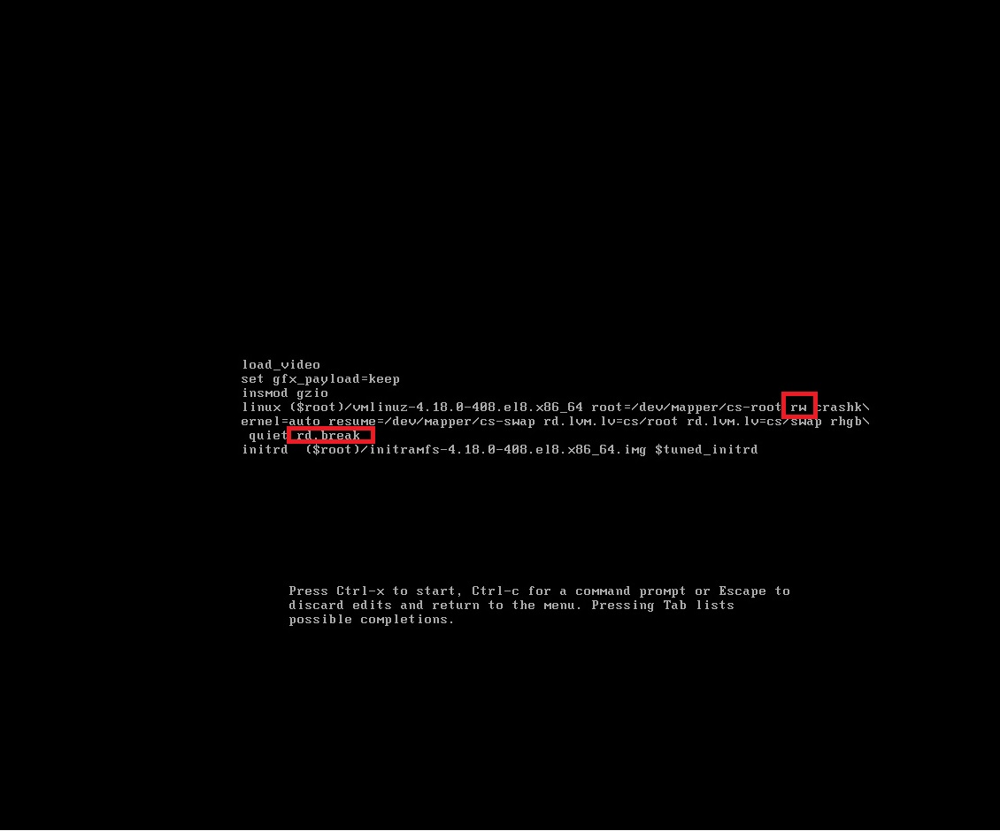
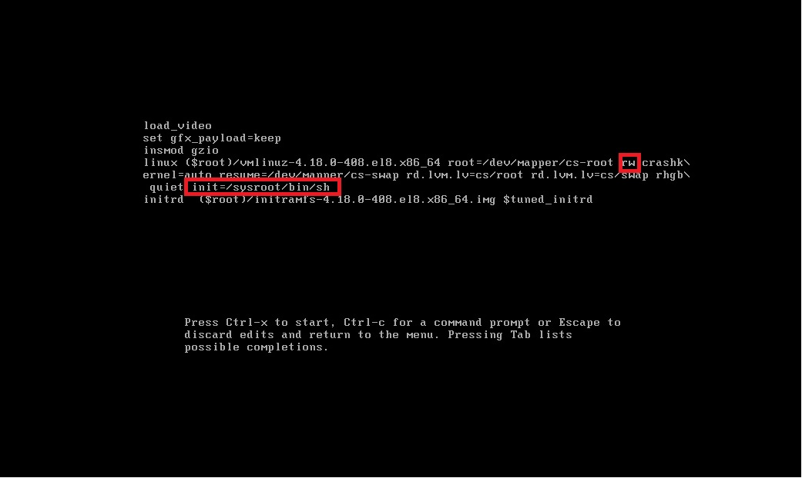
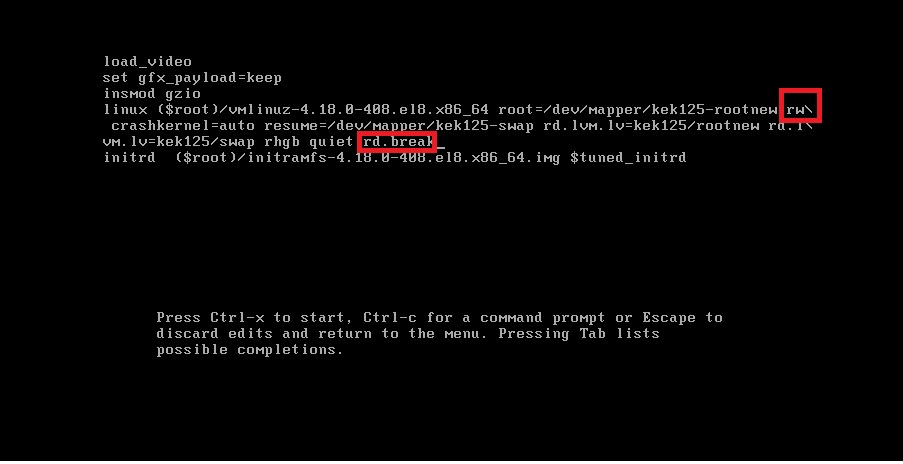
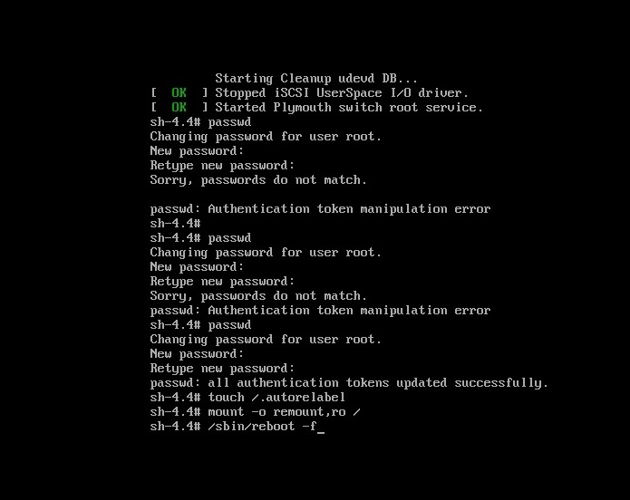
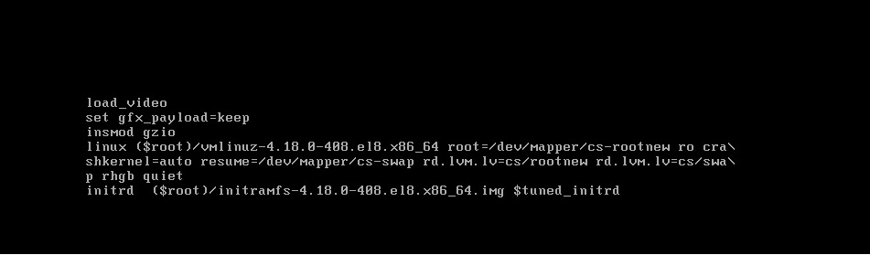
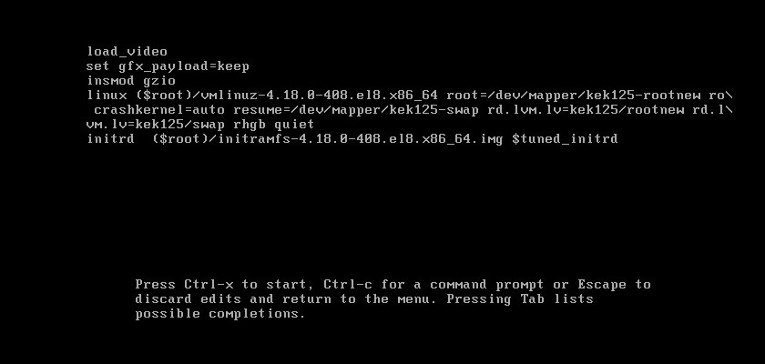
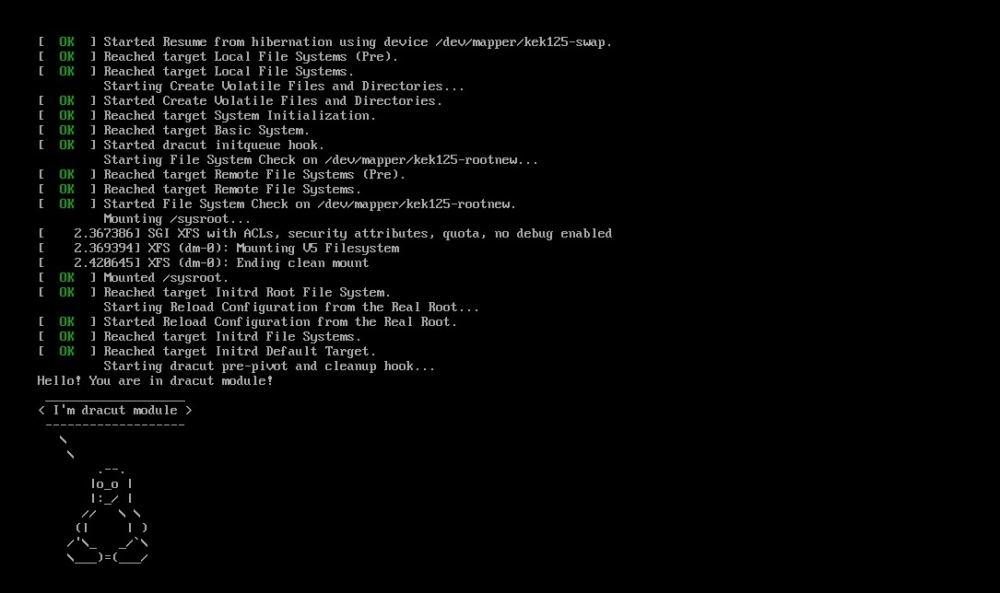

## Выполнение домашних работ по курсу OTUS - Administrator Linux.Professional


## Lesson1

<details>

### Задача: 

- **1) Обновить ядро ОС из репозитория ELRepo**
- **2) Создать Vagrant box c помощью Packer**
- **3) Загрузить Vagrant box в Vagrant Cloud**

Создаем ВМ используя и запуская Vagrantfile:

```
# Описываем Виртуальные машины
MACHINES = {
  # Указываем имя ВМ "kernel update"
  :"kernel-update" => {
              #Какой vm box будем использовать
              :box_name => "centos/stream8",
              #Указываем box_version
              :box_version => "20210210.0",
              #Указываем количество ядер ВМ
              :cpus => 2,
              #Указываем количество ОЗУ в мегабайтах
              :memory => 4096,
            }
}

Vagrant.configure("2") do |config|
  MACHINES.each do |boxname, boxconfig|
    # Отключаем проброс общей папки в ВМ
    config.vm.synced_folder ".", "/vagrant", disabled: true
    # Применяем конфигруацию ВМ
    config.vm.define boxname do |box|
      box.vm.box = boxconfig[:box_name]
      box.vm.box_version = boxconfig[:box_version]
      box.vm.host_name = boxname.to_s
      box.vm.provider "virtualbox" do |v|
        v.memory = boxconfig[:memory]
        v.cpus = boxconfig[:cpus]
      end
    end
  end
end
```
Подключаемся к ВМ:
```
vagrant ssh
```

Перед работами проверим текущую версию ядра:
```
~/Documents/OTUS_Linux_Prof/Lesson1$ vagrant ssh
[vagrant@kernel-update ~]$ uname -r
4.18.0-277.el8.x86_64
```
Далее подключим репозиторий, откуда возьмём необходимую версию ядра:

```
sudo yum install -y https://www.elrepo.org/elrepo-release-8.el8.elrepo.noarch.rpm

```

В репозитории есть две версии ядер:
- **kernel-ml — свежие и стабильные ядра**
- **kernel-lt — стабильные ядра с длительной версией поддержки, более старые, чем версия ml.**

Установим последнее ядро(kernel-ml) из репозитория:

```
dnf --enablerepo="elrepo-kernel" install -y kernel-ml
```
После перезагрузки снова проверяем версию ядра:

```
~/Documents/OTUS_Linux_Prof/Lesson1$ vagrant ssh
Last login: Thu Dec 29 09:09:45 2022 from 10.0.2.2
[vagrant@kernel-update ~]$ uname -r
6.1.1-1.el8.elrepo.x86_6
```

### Работа с Packer

Тесты показали, что при использовании 7ой версии VirtualBox стабильно получаем ошибку:
```
virtualbox dracut-initqueue
```
На 6ой версии всё проходит без проблем.

В скриптах, выданных для ДЗ были заменены:

чексумма и ссылка на образ в centos.json - т.к. старые ссылки не работают.
количество памяти и ядер для более быстрой сборки.

В файл ks.cfg добавлен код, для повышения привелегий учетки Vagrant без запроса пароля,
без этого сборка образа вылетает, потому что запрашивается sudo пароль для учётки Vagrant,
проверял это на ручной установке.Судя по коду и документации sudo пароль должен ввестись,
но этого не происходит(

Собираем образ:

```
packer build centos.json
```

Образ успешно собран:
```
==> centos-8: Gracefully halting virtual machine...
==> centos-8: Preparing to export machine...
    centos-8: Deleting forwarded port mapping for the communicator (SSH, WinRM, etc) (host port 2904)
==> centos-8: Exporting virtual machine...
    centos-8: Executing: export packer-centos-vm --output builds/packer-centos-vm.ovf --manifest --vsys 0 --description CentOS Stream 8 with kernel 5.x --version 8
==> centos-8: Cleaning up floppy disk...
==> centos-8: Deregistering and deleting VM...
==> centos-8: Running post-processor: vagrant
==> centos-8 (vagrant): Creating a dummy Vagrant box to ensure the host system can create one correctly
==> centos-8 (vagrant): Creating Vagrant box for 'virtualbox' provider
    centos-8 (vagrant): Copying from artifact: builds/packer-centos-vm-disk001.vmdk
    centos-8 (vagrant): Copying from artifact: builds/packer-centos-vm.mf
    centos-8 (vagrant): Copying from artifact: builds/packer-centos-vm.ovf
    centos-8 (vagrant): Renaming the OVF to box.ovf...
    centos-8 (vagrant): Compressing: Vagrantfile
    centos-8 (vagrant): Compressing: box.ovf
    centos-8 (vagrant): Compressing: metadata.json
    centos-8 (vagrant): Compressing: packer-centos-vm-disk001.vmdk
    centos-8 (vagrant): Compressing: packer-centos-vm.mf
Build 'centos-8' finished after 19 minutes 41 seconds.

==> Wait completed after 19 minutes 41 seconds

==> Builds finished. The artifacts of successful builds are:
--> centos-8: 'virtualbox' provider box: centos-8-kernel-5-x86_64-Minimal.box
```

После создания образа, его рекомендуется проверить. Для проверки импортируем полученный vagrant box в Vagrant:

```
mity@ubuntu:~/Documents/OTUS_Linux_Prof/Lesson1/packer$ vagrant box add centos8-kernel5 centos-8-kernel-5-x86_64-Minimal.box
==> box: Box file was not detected as metadata. Adding it directly...
==> box: Adding box 'centos8-kernel5' (v0) for provider: 
    box: Unpacking necessary files from: file:///home/mity/Documents/OTUS_Linux_Prof/Lesson1/packer/centos-8-kernel-5-x86_64-Minimal.box
==> box: Successfully added box 'centos8-kernel5' (v0) for 'virtualbox'!

```

Проверим, что образ теперь есть в списке имеющихся образов vagrant:

```
mity@ubuntu:~/Documents/OTUS_Linux_Prof/Lesson1/packer$ vagrant box list
centos/stream8  (virtualbox, 20210210.0)
centos8-kernel5 (virtualbox, 0)
ubuntu/xenial64 (virtualbox, 20211001.0.0)
```

Создадим Vagrantfile на основе образа centos8-kernel5: 

```
vagrant init centos8-kernel5
```

Запустим нашу ВМ:
```
 vagrant up 
```
Подключимя к ней по SSH:
```
vagrant ssh 
```
Проверим версию ядра: 
```
[vagrant@otus-c8 ~]$ uname -r
6.1.1-1.el8.elrepo.x86_64
```
### Ошибка Vagrant was unable to mount VirtualBox shared folders.

Решение:
```
vagrant destroy
vagrant plugin update vagrant-vbguest
vagrant up
```

- **3) Загрузить Vagrant box в Vagrant Cloud**

Регистрируемся на https://app.vagrantup.com/
В разделе Security создаем и сохраняем токен

Логинимся используя токен:
```
vagrant login --token ABCD1234
```

Проверяем, что успешно залогинились:
```
vagrant login --check
```
Загружаем образ командой:
```
vagrant cloud publish artofsky/centos8-kernel5 1.0.0 virtualbox centos-8-kernel-5-x86_64-Minimal.box
```

```
You are about to publish a box on Vagrant Cloud with the following options:
artofsky/centos8-kernel5:   (v1.0.0) for provider 'virtualbox'
Do you wish to continue? [y/N]y
Saving box information...
Uploading provider with file /home/mity/Documents/OTUS_Linux_Prof/Lesson1/packer/centos-8-kernel-5-x86_64-Minimal.box
Complete! Published artofsky/centos8-kernel5
Box:              artofsky/centos8-kernel5
Description:      
Private:          yes
Created:          2022-12-30T14:53:39.859Z
Updated:          2022-12-30T14:53:39.859Z
Current Version:  N/A
Versions:         1.0.0
Downloads:        0
```

</details>

## Lesson2

<details>

### Задачи

* добавить в Vagrantfile еще дисков
* собрать R0/R5/R10 на выбор
* Создание конфигурационного файла mdadm.conf
* Сломать/починить RAID
* Создать GPT раздел, пять партиций и смонтировать их на диск

⭐ Vagrantfile, который сразу собирает систему с подключенным рейдом и смонтированными разделами.


### добавить в Vagrantfile еще дисков

добавим 5ый диск 

```
MACHINES = {
  :otuslinux => {
        :box_name => "centos/7",
        :ip_addr => '192.168.11.101',
        :disks => {
                :sata1 => {
                        :dfile => './sata1.vdi',
                        :size => 250,
                        :port => 1
                },
                :sata2 => {
                        :dfile => './sata2.vdi',
                        :size => 250, # Megabytes
                        :port => 2
                },
                :sata3 => {
                        :dfile => './sata3.vdi',
                        :size => 250,
                        :port => 3
                },
                :sata4 => {
                        :dfile => './sata4.vdi',
                        :size => 250, # Megabytes
                        :port => 4
                },
                :sata5 => {
                        :dfile => './sata5.vdi',
                        :size => 250, # Megabytesvav
                        :port => 5
                }

        }


  },
}

```

Просмотр наличия блочных устройств

```
[vagrant@localhost ~]$ sudo lsblk
NAME   MAJ:MIN RM  SIZE RO TYPE MOUNTPOINT
sda      8:0    0  250M  0 disk 
sdb      8:16   0  250M  0 disk 
sdc      8:32   0  250M  0 disk 
sdd      8:48   0  250M  0 disk 
sde      8:64   0  250M  0 disk 
sdf      8:80   0   40G  0 disk 
└─sdf1   8:81   0   40G  0 part 
```

### собрать R0/R5/R10 на выбор

Занулим суперблоки:

```
sudo mdadm --zero-superblock --force /dev/sd{b,c,d,e,f}
[vagrant@localhost ~]$ sudo mdadm --zero-superblock --force /dev/sd{b,c,d,e,a}
mdadm: Unrecognised md component device - /dev/sdb
mdadm: Unrecognised md component device - /dev/sdc
mdadm: Unrecognised md component device - /dev/sdd
mdadm: Unrecognised md component device - /dev/sde
mdadm: Unrecognised md component device - /dev/sda
```
Создаем рейд 6

```
[vagrant@localhost ~]$ sudo mdadm --create --verbose /dev/md0 -l 6 -n 5 /dev/sd{b,c,d,e,a}
mdadm: layout defaults to left-symmetric
mdadm: layout defaults to left-symmetric
mdadm: chunk size defaults to 512K
mdadm: size set to 253952K
mdadm: Defaulting to version 1.2 metadata
mdadm: array /dev/md0 started.
```

Проверим что RAID собралсā нормалþно:

```
[vagrant@localhost ~]$ cat /proc/mdstat
Personalities : [raid6] [raid5] [raid4] 
md0 : active raid6 sda[4] sde[3] sdd[2] sdc[1] sdb[0]
      761856 blocks super 1.2 level 6, 512k chunk, algorithm 2 [5/5] [UUUUU]

```
Проверяем характеристики рейда:

```
vagrant@localhost ~]$ sudo mdadm -D /dev/md0
/dev/md0:
           Version : 1.2
     Creation Time : Sun Jan  1 14:35:34 2023
        Raid Level : raid6
        Array Size : 761856 (744.00 MiB 780.14 MB)
     Used Dev Size : 253952 (248.00 MiB 260.05 MB)
      Raid Devices : 5
     Total Devices : 5
       Persistence : Superblock is persistent

       Update Time : Sun Jan  1 14:35:40 2023
             State : clean 
    Active Devices : 5
   Working Devices : 5
    Failed Devices : 0
     Spare Devices : 0

            Layout : left-symmetric
        Chunk Size : 512K

Consistency Policy : resync

              Name : localhost.localdomain:0  (local to host localhost.localdomain)
              UUID : cc00d5b1:f34e140f:a876a3fc:8759d932
            Events : 17

    Number   Major   Minor   RaidDevice State
       0       8       16        0      active sync   /dev/sdb
       1       8       32        1      active sync   /dev/sdc
       2       8       48        2      active sync   /dev/sdd
       3       8       64        3      active sync   /dev/sde
       4       8        0        4      active sync   /dev/sda
```

### Создание конфигурационного файла mdadm.conf

```
mkdir /etc/mdadm
echo "DEVICE partitions" > /etc/mdadm/mdadm.conf
mdadm --detail --scan --verbose | awk '/ARRAY/ {print}' >> /etc/mdadm/mdadm.conf
```

Проверяем содержимое mdadm.conf:

```
[root@localhost vagrant]# cat /etc/mdadm/mdadm.conf 
DEVICE partitions
ARRAY /dev/md0 level=raid6 num-devices=5 metadata=1.2 name=localhost.localdomain:0 UUID=cc00d5b1:f34e140f:a876a3fc:8759d932
```

### Сломать/починить RAID

Ломаю массив, искуственно переводя в статус "fail" один из дисков, проверяю статус массива:

```
mdadm /dev/md0 --fail /dev/sdc
```

```
[root@localhost vagrant]# cat /proc/mdstat
Personalities : [raid6] [raid5] [raid4] 
md0 : active raid6 sda[4] sde[3] sdd[2] sdc[1](F) sdb[0]
      761856 blocks super 1.2 level 6, 512k chunk, algorithm 2 [5/4] [U_UUU]
```

Восстанавливаю рейд, сначала удалив диск из массива, а затем "вставив" его же назад:

```
[root@localhost vagrant]# mdadm --remove /dev/md0 /dev/sdc
mdadm: hot removed /dev/sdc from /dev/md0
mdadm --add /dev/md0 /dev/sdc
```

После смотрим на дебаг:

```
$ watch --interval=1 cat /proc/mdstat
```

### Создать GPT раздел, пять партиций и смонтировать их на диск

Создаем раздел GPT на RAID
```
parted -s /dev/md0 mklabel gpt
```
Создаем партиции:
```
parted /dev/md0 mkpart primary ext4 0% 20%
parted /dev/md0 mkpart primary ext4 20% 40%
parted /dev/md0 mkpart primary ext4 40% 60%
parted /dev/md0 mkpart primary ext4 60% 80%
parted /dev/md0 mkpart primary ext4 80% 100%
```

```
[root@localhost raid]# lsblk
NAME      MAJ:MIN RM   SIZE RO TYPE  MOUNTPOINT
sda         8:0    0   250M  0 disk  
└─md0       9:0    0   744M  0 raid6 
  ├─md0p1 259:0    0   147M  0 md    /raid/part1
  ├─md0p2 259:1    0 148.5M  0 md    /raid/part2
  ├─md0p3 259:2    0   150M  0 md    /raid/part3
  ├─md0p4 259:3    0 148.5M  0 md    /raid/part4
  └─md0p5 259:4    0   147M  0 md    /raid/part5
sdb         8:16   0   250M  0 disk  
└─md0       9:0    0   744M  0 raid6 
  ├─md0p1 259:0    0   147M  0 md    /raid/part1
  ├─md0p2 259:1    0 148.5M  0 md    /raid/part2
  ├─md0p3 259:2    0   150M  0 md    /raid/part3
  ├─md0p4 259:3    0 148.5M  0 md    /raid/part4
  └─md0p5 259:4    btrfs0   147M  0 md    /raid/part5
sdc         8:32   0   250M  0 disk  
└─md0       9:0    0   744M  0 raid6 
  ├─md0p1 259:0    0   147M  0 md    /raid/part1
  ├─md0p2 259:1    0 148.5M  0 md    /raid/part2
  ├─md0p3 259:2    0   150M  0 md    /raid/part3
  ├─md0p4 259:3    0 148.5M  0 md    /raid/part4
  └─md0p5 259:4    0   147M  0 md    /raid/part5
sdd         8:48   0   250M  0 disk  
└─md0       9:0    0   744M  0 raid6 
  ├─md0p1 259:0    0   147M  0 md    /raid/part1
  ├─md0p2 259:1    0 148.5M  0 md    /raid/part2
  ├─md0p3 259:2    0   150M  0 md    /raid/part3
  ├─md0p4 259:3    0 148.5M  0 md    /raid/part4
  └─md0p5 259:4    0   147M  0 md    /raid/part5
sde         8:64   0   250M  0 disk  
└─md0       9:0    0   744M  0 raid6 
  ├─md0p1 259:0    0   147M  0 md    /raid/part1
  ├─md0p2 259:1    0 148.5M  0 md    /raid/part2
  ├─md0p3 259:2    0   150M  0 md    /raid/part3
  ├─md0p4 259:3    0 148.5M  0 md    /raid/part4
  └─md0p5 259:4    0   147M  0 md    /raid/part5
sdf         8:80   0    40G  0 disk  
└─sdf1      8:81   0    40G  0 part  /
```


Делаем отдельный файл, который говорит, что нужно собрать рейд:

```
cat setup.sh 
#!/bin/env bash
yum update -y
yum install -y mdadm smartmontools hdparm gdisk
mdadm --zero-superblock --force /dev/sd{b,c,d,e,f}
mdadm --create --verbose /dev/md0 -l 6 -n 5 /dev/sd{b,c,d,e,f}
mkdir /etc/mdadm
echo "DEVICE partitions" > /etc/mdadm/mdadm.conf
mdadm --detail --scan --verbose | awk '/ARRAY/ {print}' >> /etc/mdadm/mdadm.conf
parted -s /dev/md0 mklabel gpt
parted /dev/md0 mkpart primary ext4 0% 20%
parted /dev/md0 mkpart primary ext4 20% 40%
parted /dev/md0 mkpart primary ext4 40% 60%
parted /dev/md0 mkpart primary ext4 60% 80%
parted /dev/md0 mkpart primary ext4 80% 100%
for i in $(seq 1 5); do sudo mkfs.ext4 /dev/md0p$i; done
mkdir -p /raid/part{1,2,3,4,5}
for i in $(seq 1 5); do mount /dev/md0p$i /raid/part$i; done
```

Добавляем инструкцию в Vagrantfile:

```
box.vm.provision "shell", path: "setup.sh"
```

Выполняем reload:

```
/OTUS_Linux_Prof/Lesson2/otus-linux$ vagrant reload --provision
```

### ⭐ Vagrantfile, который сразу собирает систему с подключенным рейдом и смонтированными разделами.

Отредактируем Vagrantfile, укажем инструкцию для запуска скрипта и сам скрипт, который соберет 10 рейд:

```
# -*- mode: ruby -*-
# vim: set ft=ruby :

MACHINES = {
  :otuslinux => {
        :box_name => "centos/7",
        :ip_addr => '192.168.11.101',
	:disks => {
		:sata1 => {
			:dfile => './sata1.vdi',
			:size => 250,
			:port => 1
		},
		:sata2 => {
                        :dfile => './sata2.vdi',
                        :size => 250,
			:port => 2
		},
                :sata3 => {
                        :dfile => './sata3.vdi',
                        :size => 250,
                        :port => 3
                },
                :sata4 => {
                        :dfile => './sata4.vdi',
                        :size => 250,
                        :port => 4
                },
                :sata5 => {
                        :dfile => './sata5.vdi',
                        :size => 250,
                        :port => 5
                }

	}
  },
}

Vagrant.configure("2") do |config|

  MACHINES.each do |boxname, boxconfig|

      config.vm.define boxname do |box|

          box.vm.box = boxconfig[:box_name]
          box.vm.host_name = boxname.to_s

          box.vm.network "private_network", ip: boxconfig[:ip_addr]

          box.vm.provider :virtualbox do |vb|
            	  vb.customize ["modifyvm", :id, "--memory", "1024"]
                  needsController = false
		  boxconfig[:disks].each do |dname, dconf|
			  unless File.exist?(dconf[:dfile])
				vb.customize ['createhd', '--filename', dconf[:dfile], '--variant', 'Fixed', '--size', dconf[:size]]
                                needsController =  true
                          end

		  end
                  if needsController == true
                     vb.customize ["storagectl", :id, "--name", "SATA", "--add", "sata" ]
                     boxconfig[:disks].each do |dname, dconf|
                         vb.customize ['storageattach', :id,  '--storagectl', 'SATA', '--port', dconf[:port], '--device', 0, '--type', 'hdd', '--medium', dconf[:dfile]]
                     end
                  end
          end

 	  box.vm.provision "shell", path: "setup.sh"
      end
  end
end

```

```
mity@ubuntu:~/Documents/OTUS_Linux_Prof/Lesson2/otus-linux$ cat setup.sh 
#!/bin/env bash
yum update -y
yum install -y mdadm smartmontools hdparm gdisk
mdadm --zero-superblock --force /dev/sd{b,c,d,e,f}
mdadm --create --verbose /dev/md0 -l 10 -n 5 /dev/sd{b,c,d,e,f}
mkdir /etc/mdadm
echo "DEVICE partitions" > /etc/mdadm/mdadm.conf
mdadm --detail --scan --verbose | awk '/ARRAY/ {print}' >> /etc/mdadm/mdadm.conf
parted -s /dev/md0 mklabel gpt
parted /dev/md0 mkpart primary ext4 0% 20%
parted /dev/md0 mkpart primary ext4 20% 40%
parted /dev/md0 mkpart primary ext4 40% 60%
parted /dev/md0 mkpart primary ext4 60% 80%
parted /dev/md0 mkpart primary ext4 80% 100%
for i in $(seq 1 5); do sudo mkfs.ext4 /dev/md0p$i; done
mkdir -p /raid/part{1,2,3,4,5}
for i in $(seq 1 5); do mount /dev/md0p$i /raid/part$i; done

```

Проверим:

```
[vagrant@localhost ~]$ lsblk 
NAME      MAJ:MIN RM   SIZE RO TYPE   MOUNTPOINT
sda         8:0    0    40G  0 disk   
└─sda1      8:1    0    40G  0 part   /
sdb         8:16   0   250M  0 disk   
└─md0       9:0    0   620M  0 raid10 
  ├─md0p1 259:0    0 122.5M  0 md     /raid/part1
  ├─md0p2 259:1    0 122.5M  0 md     /raid/part2
  ├─md0p3 259:2    0   125M  0 md     /raid/part3
  ├─md0p4 259:3    0 122.5M  0 md     /raid/part4
  └─md0p5 259:4    0 122.5M  0 md     /raid/part5
sdc         8:32   0   250M  0 disk   
└─md0       9:0    0   620M  0 raid10 
  ├─md0p1 259:0    0 122.5M  0 md     /raid/part1
  ├─md0p2 259:1    0 122.5M  0 md     /raid/part2
  ├─md0p3 259:2    0   125M  0 md     /raid/part3
  ├─md0p4 259:3    0 122.5M  0 md     /raid/part4
  └─md0p5 259:4    0 122.5M  0 md     /raid/part5
sdd         8:48   0   250M  0 disk   
└─md0       9:0    0   620M  0 raid10 
  ├─md0p1 259:0    0 122.5M  0 md     /raid/part1
  ├─md0p2 259:1    0 122.5M  0 md     /raid/part2
  ├─md0p3 259:2    0   125M  0 md     /raid/part3
  ├─md0p4 259:3    0 122.5M  0 md     /raid/part4
  └─md0p5 259:4    0 122.5M  0 md     /raid/part5
sde         8:64   0   250M  0 disk   
└─md0       9:0    0   620M  0 raid10 
  ├─md0p1 259:0    0 122.5M  0 md     /raid/part1
  ├─md0p2 259:1    0 122.5M  0 md     /raid/part2
  ├─md0p3 259:2    0   125M  0 md     /raid/part3
  ├─md0p4 259:3    0 122.5M  0 md     /raid/part4
  └─md0p5 259:4    0 122.5M  0 md     /raid/part5
sdf         8:80   0   250M  0 disk   
└─md0       9:0    0   620M  0 raid10 
  ├─md0p1 259:0    0 122.5M  0 md     /raid/part1
  ├─md0p2 259:1    0 122.5M  0 md     /raid/part2
  ├─md0p3 259:2    0   125M  0 md     /raid/part3
  ├─md0p4 259:3    0 122.5M  0 md     /raid/part4
  └─md0p5 259:4    0 122.5M  0 md     /raid/part5

```


</details>


## Lesson3-4

<details>
При выполнении ДЗ использовались данные по настройке ZFS из статьи https://www.symmcom.com/docs/how-tos/storages/how-to-install-zfs-on-centos-7


на имеющемся образе: 

- уменьшить том под / до 8G

- выделить том под /var + в mirror

- выделить том под /home

- /home - сделать том для снэпшотов

- прописать монтирование в fstab

#### и попробовать с разными опциями и разными файловыми системами ( на выбор):

- сгенерить файлы в /home/
- снять снэпшот
- удалить часть файлов
- восстановится со снэпшота
- залоггировать работу можно с помощью утилиты script

⭐  на нашей куче дисков попробовать поставить btrfs/zfs - с кешем, снэпшотами - разметить здесь каталог /opt


#### уменьшить том под / до 8G

Данные по системе:
```
[root@localhost ~]# df -h
Filesystem                       Size  Used Avail Use% Mounted on
/dev/mapper/VolGroup00-LogVol00   38G  838M   37G   3% /
devtmpfs                         109M     0  109M   0% /dev
tmpfs                            118M     0  118M   0% /dev/shm
tmpfs                            118M  4.5M  114M   4% /run
tmpfs                            118M     0  118M   0% /sys/fs/cgroup
/dev/sda2                       1014M   63M  952M   7% /boot
tmpfs                             24M     0   24M   0% /run/user/1000
```

```
[root@localhost ~]# lsblk 
NAME                    MAJ:MIN RM  SIZE RO TYPE MOUNTPOINT
sda                       8:0    0   40G  0 disk 
├─sda1                    8:1    0    1M  0 part 
├─sda2                    8:2    0    1G  0 part /boot
└─sda3                    8:3    0   39G  0 part 
  ├─VolGroup00-LogVol00 253:0    0 37.5G  0 lvm  /
  └─VolGroup00-LogVol01 253:1    0  1.5G  0 lvm  [SWAP]
sdb                       8:16   0   10G  0 disk 
sdc                       8:32   0    2G  0 disk 
sdd                       8:48   0    1G  0 disk 
sde                       8:64   0    1G  0 disk 
```

Создаём:
 - временный физический том для / раздела
 - группу томов VG02
 - временный том


```
pvcreate /dev/sdb
```

```
[root@localhost ~]# vgcreate VG02 /dev/sdb
  Volume group "VG02" successfully created
```

```
[root@localhost ~]# lvcreate -n xtmp -l+100%FREE /dev/VG02
  Logical volume "xtmp" created.
```

Создаём ФС xfs и монтируем:

```
[root@localhost ~]# mkfs.xfs /dev/VG02/xtmp && mount /dev/VG02/xtmp /mnt
meta-data=/dev/VG02/xtmp         isize=512    agcount=4, agsize=655104 blks
         =                       sectsz=512   attr=2, projid32bit=1
         =                       crc=1        finobt=0, sparse=0
data     =                       bsize=4096   blocks=2620416, imaxpct=25
         =                       sunit=0      swidth=0 blks
naming   =version 2              bsize=4096   ascii-ci=0 ftype=1
log      =internal log           bsize=4096   blocks=2560, version=2
         =                       sectsz=512   sunit=0 blks, lazy-count=1
realtime =none                   extsz=4096   blocks=0, rtextents=0
```

Переносим данные:

```
[root@localhost ~]# xfsdump -J - /dev/VolGroup00/LogVol00 | xfsrestore -J - /mnt
xfsrestore: using file dump (drive_simple) strategy
xfsrestore: version 3.1.7 (dump format 3.0)
xfsdump: using file dump (drive_simple) strategy
xfsdump: version 3.1.7 (dump format 3.0)
xfsdump: level 0 dump of localhost.localdomain:/
xfsdump: dump date: Tue Jan  3 12:37:23 2023
xfsdump: session id: 9c73702c-820a-4a8f-b402-bf04cd18d3a7
xfsdump: session label: ""
xfsrestore: searching media for dump
xfsdump: ino map phase 1: constructing initial dump list
xfsdump: ino map phase 2: skipping (no pruning necessary)
xfsdump: ino map phase 3: skipping (only one dump stream)
xfsdump: ino map construction complete
xfsdump: estimated dump size: 840029312 bytes
xfsdump: creating dump session media file 0 (media 0, file 0)
xfsdump: dumping ino map
xfsdump: dumping directories
xfsrestore: examining media file 0
xfsrestore: dump description: 
xfsrestore: hostname: localhost.localdomain
xfsrestore: mount point: /
xfsrestore: volume: /dev/mapper/VolGroup00-LogVol00
xfsrestore: session time: Tue Jan  3 12:37:23 2023
xfsrestore: level: 0
xfsrestore: session label: ""
xfsrestore: media label: ""
xfsrestore: file system id: b60e9498-0baa-4d9f-90aa-069048217fee
xfsrestore: session id: 9c73702c-820a-4a8f-b402-bf04cd18d3a7
xfsrestore: media id: 403bd2f6-b2d8-48af-b29f-e84101a92961
xfsrestore: searching media for directory dump
xfsrestore: reading directories
xfsdump: dumping non-directory files
xfsrestore: 2673 directories and 23425 entries processed
xfsrestore: directory post-processing
xfsrestore: restoring non-directory files
xfsdump: ending media file
xfsdump: media file size 817206736 bytes
xfsdump: dump size (non-dir files) : 804137608 bytes
xfsdump: dump complete: 17 seconds elapsed
xfsdump: Dump Status: SUCCESS
xfsrestore: restore complete: 17 seconds elapsed
xfsrestore: Restore Status: SUCCESS
```

Проверяем:

```
[root@localhost ~]# ls /mnt
bin  boot  dev  etc  home  lib  lib64  media  mnt  opt  proc  root  run  sbin  srv  sys  tmp  usr  var
```

Сымитируем текущий root -> сделаем в него chroot и обновим grub:

```
for i in /proc/ /sys/ /dev/ /run/ /boot/; do mount --bind $i /mnt/$i; done
[root@localhost ~]# chroot /mnt/
[root@localhost /]# 
```

```
[root@localhost /]# grub2-mkconfig -o /boot/grub2/grub.cfg
Generating grub configuration file ...
Found linux image: /boot/vmlinuz-3.10.0-862.2.3.el7.x86_64
Found initrd image: /boot/initramfs-3.10.0-862.2.3.el7.x86_64.img
done
```

Обновим образ initrd:

```
[root@localhost /]# cd /boot ; for i in `ls initramfs-*img`; do dracut -v $i `echo $i|sed "s/initramfs-//g; s/.img//g"` --force; done
Executing: /sbin/dracut -v initramfs-3.10.0-862.2.3.el7.x86_64.img 3.10.0-862.2.3.el7.x86_64 --force
dracut module 'busybox' will not be installed, because command 'busybox' could not be found!
dracut module 'crypt' will not be installed, because command 'cryptsetup' could not be found!
dracut module 'dmraid' will not be installed, because command 'dmraid' could not be found!
dracut module 'dmsquash-live-ntfs' will not be installed, because command 'ntfs-3g' could not be found!
dracut module 'mdraid' will not be installed, because command 'mdadm' could not be found!
dracut module 'multipath' will not be installed, because command 'multipath' could not be found!
dracut module 'busybox' will not be installed, because command 'busybox' could not be found!
dracut module 'crypt' will not be installed, because command 'cryptsetup' could not be found!
dracut module 'dmraid' will not be installed, because command 'dmraid' could not be found!
dracut module 'dmsquash-live-ntfs' will not be installed, because command 'ntfs-3g' could not be found!
dracut module 'mdraid' will not be installed, because command 'mdadm' could not be found!
dracut module 'multipath' will not be installed, because command 'multipath' could not be found!
*** Including module: bash ***
*** Including module: nss-softokn ***
*** Including module: i18n ***
*** Including module: drm ***
*** Including module: plymouth ***
*** Including module: dm ***
Skipping udev rule: 64-device-mapper.rules
Skipping udev rule: 60-persistent-storage-dm.rules
Skipping udev rule: 55-dm.rules
*** Including module: kernel-modules ***
Omitting driver floppy
*** Including module: lvm ***
Skipping udev rule: 64-device-mapper.rules
Skipping udev rule: 56-lvm.rules
Skipping udev rule: 60-persistent-storage-lvm.rules
*** Including module: qemu ***
*** Including module: resume ***
*** Including module: rootfs-block ***
*** Including module: terminfo ***
*** Including module: udev-rules ***
Skipping udev rule: 40-redhat-cpu-hotplug.rules
Skipping udev rule: 91-permissions.rules
*** Including module: biosdevname ***
*** Including module: systemd ***
*** Including module: usrmount ***
*** Including module: base ***
*** Including module: fs-lib ***
*** Including module: shutdown ***
*** Including modules done ***
*** Installing kernel module dependencies and firmware ***
*** Installing kernel module dependencies and firmware done ***
*** Resolving executable dependencies ***
*** Resolving executable dependencies done***
*** Hardlinking files ***
*** Hardlinking files done ***
*** Stripping files ***
*** Stripping files done ***
*** Generating early-microcode cpio image contents ***
*** No early-microcode cpio image needed ***
*** Store current command line parameters ***
*** Creating image file ***
*** Creating image file done ***
*** Creating initramfs image file '/boot/initramfs-3.10.0-862.2.3.el7.x86_64.img' done ***
```

Изменяем адрес корня и проверяем:

```
sed -i 's/VolGroup00\/LogVol00/VG02\/xtmp/g' /boot/grub2/grub.cfg

[root@localhost boot]# grep VolGroup00 /boot/grub2/grub.cfg
	linux16 /vmlinuz-3.10.0-862.2.3.el7.x86_64 root=/dev/mapper/VG02-xtmp ro no_timer_check console=tty0 console=ttyS0,115200n8 net.ifnames=0 biosdevname=0 elevator=noop crashkernel=auto rd.lvm.lv=VG02/xtmp rd.lvm.lv=VolGroup00/LogVol01 rhgb quiet 

```

Перезагружаемся:
```
[root@localhost boot]# exit
exit
[root@localhost ~]# reboot

```


Просле ребута:

```
[vagrant@localhost ~]$ lsblk
NAME                    MAJ:MIN RM  SIZE RO TYPE MOUNTPOINT
sda                       8:0    0   40G  0 disk 
├─sda1                    8:1    0    1M  0 part 
├─sda2                    8:2    0    1G  0 part /boot
└─sda3                    8:3    0   39G  0 part 
  ├─VolGroup00-LogVol01 253:1    0  1.5G  0 lvm  [SWAP]
  └─VolGroup00-LogVol00 253:2    0 37.5G  0 lvm  
sdb                       8:16   0   10G  0 disk 
└─VG02-xtmp             253:0    0   10G  0 lvm  /
sdc                       8:32   0    2G  0 disk 
sdd                       8:48   0    1G  0 disk 
sde                       8:64   0    1G  0 disk 
```

Удаляем старый том:

```
[vagrant@localhost ~]$ lvremove /dev/VolGroup00/LogVol00
Do you really want to remove active logical volume VolGroup00/LogVol00? [y/n]: y
  Logical volume "LogVol00" successfully removed
```

Создаём новый том поменьше:

```
[root@localhost vagrant]# lvcreate -n VolGroup00/LogVol00 -L 8G /dev/VolGroup00
WARNING: xfs signature detected on /dev/VolGroup00/LogVol00 at offset 0. Wipe it? [y/n]: y
  Wiping xfs signature on /dev/VolGroup00/LogVol00.
  Logical volume "LogVol00" created.
```

На новом томе создаём ФС xfs:

```
[root@localhost vagrant]# mkfs.xfs /dev/VolGroup00/LogVol00
meta-data=/dev/VolGroup00/LogVol00 isize=512    agcount=4, agsize=524288 blks
         =                       sectsz=512   attr=2, projid32bit=1
         =                       crc=1        finobt=0, sparse=0
data     =                       bsize=4096   blocks=2097152, imaxpct=25
         =                       sunit=0      swidth=0 blks
naming   =version 2              bsize=4096   ascii-ci=0 ftype=1
log      =internal log           bsize=4096   blocks=2560, version=2
         =                       sectsz=512   sunit=0 blks, lazy-count=1
realtime =none                   extsz=4096   blocks=0, rtextents=0
```

Монтирую новый том и переношу данные:

```
[root@localhost vagrant]# mount /dev/VolGroup00/LogVol00 /mnt 
[root@localhost vagrant]# xfsdump -J - /dev/VG02/xtmp | xfsrestore -J - /mnt
xfsdump: using file dump (drive_simple) strategy
xfsdump: version 3.1.7 (dump format 3.0)
xfsdump: level 0 dump of localhost.localdomain:/
xfsdump: dump date: Tue Jan  3 15:28:31 2023
xfsdump: session id: 0f7ee57d-c18c-489f-8122-61253c32bb1d
xfsdump: session label: ""
xfsrestore: using file dump (drive_simple) strategy
xfsrestore: version 3.1.7 (dump format 3.0)
xfsrestore: searching media for dump
xfsdump: ino map phase 1: constructing initial dump list
xfsdump: ino map phase 2: skipping (no pruning necessary)
xfsdump: ino map phase 3: skipping (only one dump stream)
xfsdump: ino map construction complete
xfsdump: estimated dump size: 838556352 bytes
xfsdump: creating dump session media file 0 (media 0, file 0)
xfsdump: dumping ino map
xfsdump: dumping directories
xfsrestore: examining media file 0
xfsrestore: dump description: 
xfsrestore: hostname: localhost.localdomain
xfsrestore: mount point: /
xfsrestore: volume: /dev/mapper/VG02-xtmp
xfsrestore: session time: Tue Jan  3 15:28:31 2023
xfsrestore: level: 0
xfsrestore: session label: ""
xfsrestore: media label: ""
xfsrestore: file system id: 972bf9cc-774d-4932-94b8-269a957119b7
xfsrestore: session id: 0f7ee57d-c18c-489f-8122-61253c32bb1d
xfsrestore: media id: 58e806a7-bac8-4dea-8fcf-3936992f0795
xfsrestore: searching media for directory dump
xfsrestore: reading directories
xfsdump: dumping non-directory files
xfsrestore: 2677 directories and 23430 entries processed
xfsrestore: directory post-processing
xfsrestore: restoring non-directory files
xfsdump: ending media file
xfsdump: media file size 815869816 bytes
xfsdump: dump size (non-dir files) : 802797008 bytes
xfsdump: dump complete: 15 seconds elapsed
xfsdump: Dump Status: SUCCESS
xfsrestore: restore complete: 15 seconds elapsed
xfsrestore: Restore Status: SUCCESS
```


Готовим виртуальный рут для обратного переезда, делаю chroot, обновляем загрузчик:

```
[root@localhost vagrant]# for i in /proc/ /sys/ /dev/ /run/ /boot/; do mount --bind $i /mnt/$i; done

[root@localhost vagrant]# for i in /proc/ /sys/ /dev/ /run/ /boot/; do mount --bind $i /mnt/$i; done
[root@localhost vagrant]#  chroot /mnt/
[root@localhost /]# grub2-mkconfig -o /boot/grub2/grub.cfg
Generating grub configuration file ...
Found linux image: /boot/vmlinuz-3.10.0-862.2.3.el7.x86_64
Found initrd image: /boot/initramfs-3.10.0-862.2.3.el7.x86_64.img
done


```

Обновим образ initrd:

```
cd /boot ; for i in `ls initramfs-*img`; do dracut -v $i `echo $i|sed "s/initramfs-//g; s/.img//g"` --force; done

xecuting: /sbin/dracut -v initramfs-3.10.0-862.2.3.el7.x86_64.img 3.10.0-862.2.3.el7.x86_64 --force
dracut module 'busybox' will not be installed, because command 'busybox' could not be found!
dracut module 'crypt' will not be installed, because command 'cryptsetup' could not be found!
dracut module 'dmraid' will not be installed, because command 'dmraid' could not be found!
dracut module 'dmsquash-live-ntfs' will not be installed, because command 'ntfs-3g' could not be found!
dracut module 'mdraid' will not be installed, because command 'mdadm' could not be found!
dracut module 'multipath' will not be installed, because command 'multipath' could not be found!
dracut module 'busybox' will not be installed, because command 'busybox' could not be found!
dracut module 'crypt' will not be installed, because command 'cryptsetup' could not be found!
dracut module 'dmraid' will not be installed, because command 'dmraid' could not be found!
dracut module 'dmsquash-live-ntfs' will not be installed, because command 'ntfs-3g' could not be found!
dracut module 'mdraid' will not be installed, because command 'mdadm' could not be found!
dracut module 'multipath' will not be installed, because command 'multipath' could not be found!
*** Including module: bash ***
*** Including module: nss-softokn ***
*** Including module: i18n ***
*** Including module: drm ***
*** Including module: plymouth ***
*** Including module: dm ***
Skipping udev rule: 64-device-mapper.rules
Skipping udev rule: 60-persistent-storage-dm.rules
Skipping udev rule: 55-dm.rules
*** Including module: kernel-modules ***
Omitting driver floppy
*** Including module: lvm ***
Skipping udev rule: 64-device-mapper.rules
Skipping udev rule: 56-lvm.rules
Skipping udev rule: 60-persistent-storage-lvm.rules
*** Including module: qemu ***
*** Including module: resume ***
*** Including module: rootfs-block ***
*** Including module: terminfo ***
*** Including module: udev-rules ***
Skipping udev rule: 40-redhat-cpu-hotplug.rules
Skipping udev rule: 91-permissions.rules
*** Including module: biosdevname ***
*** Including module: systemd ***
*** Including module: usrmount ***
*** Including module: base ***
*** Including module: fs-lib ***
*** Including module: shutdown ***
*** Including modules done ***
*** Installing kernel module dependencies and firmware ***
*** Installing kernel module dependencies and firmware done ***
*** Resolving executable dependencies ***
*** Resolving executable dependencies done***
*** Hardlinking files ***
*** Hardlinking files done ***
*** Stripping files ***
*** Stripping files done ***
*** Generating early-microcode cpio image contents ***
*** No early-microcode cpio image needed ***
*** Store current command line parameters ***
*** Creating image file ***
*** Creating image file done ***
*** Creating initramfs image file '/boot/initramfs-3.10.0-862.2.3.el7.x86_64.img' done ***

```


#### выделить том под /var + в mirror

Создаём физический том и группу томов под /var:

```
 [root@localhost boot]# pvcreate /dev/sdc /dev/sdd
  Physical volume "/dev/sdc" successfully created.
  Physical volume "/dev/sdd" successfully created.

[root@localhost boot]# vgcreate vg_var /dev/sdc /dev/sdd
  Volume group "vg_var" successfully created
```

Создаём сам том:
ml - указывает количество зеркал.

```
[root@localhost boot]# lvcreate -L 950M -m1 -n lv_var vg_var
  Rounding up size to full physical extent 952.00 MiB
  Logical volume "lv_var" created.
```


На новом томе создаём ФС ext4:


```
[root@localhost boot]# mkfs.ext4 /dev/vg_var/lv_var
mke2fs 1.42.9 (28-Dec-2013)
Filesystem label=
OS type: Linux
Block size=4096 (log=2)
Fragment size=4096 (log=2)
Stride=0 blocks, Stripe width=0 blocks
60928 inodes, 243712 blocks
12185 blocks (5.00%) reserved for the super user
First data block=0
Maximum filesystem blocks=249561088
8 block groups
32768 blocks per group, 32768 fragments per group
7616 inodes per group
Superblock backups stored on blocks: 
	32768, 98304, 163840, 229376

Allocating group tables: done                            
Writing inode tables: done                            
Creating journal (4096 blocks): done
Writing superblocks and filesystem accounting information: done
```

Монтирую новый том и переношу данные:
```
[root@localhost boot]# mount /dev/vg_var/lv_var /mnt

[root@localhost boot]# cp -aR /var/* /mnt/
[root@localhost boot]# rsync -avHPSAX /var/ /mnt/

```

Проверяем:

```
[root@localhost boot]# ls -la /mnt/
total 84
drwxr-xr-x. 19 root root  4096 Jan  3 16:07 .
drwxr-xr-x. 17 root root   224 Jan  3 15:28 ..
drwxr-xr-x.  2 root root  4096 Apr 11  2018 adm
drwxr-xr-x.  5 root root  4096 May 12  2018 cache
drwxr-xr-x.  3 root root  4096 May 12  2018 db
drwxr-xr-x.  3 root root  4096 May 12  2018 empty
drwxr-xr-x.  2 root root  4096 Apr 11  2018 games
drwxr-xr-x.  2 root root  4096 Apr 11  2018 gopher
drwxr-xr-x.  3 root root  4096 May 12  2018 kerberos
drwxr-xr-x. 28 root root  4096 Jan  3 15:28 lib
drwxr-xr-x.  2 root root  4096 Apr 11  2018 local
lrwxrwxrwx.  1 root root    11 Jan  3 15:28 lock -> ../run/lock
drwxr-xr-x.  8 root root  4096 Jan  3 15:21 log
drwx------.  2 root root 16384 Jan  3 16:04 lost+found
lrwxrwxrwx.  1 root root    10 Jan  3 15:28 mail -> spool/mail
drwxr-xr-x.  2 root root  4096 Apr 11  2018 nis
drwxr-xr-x.  2 root root  4096 Apr 11  2018 opt
drwxr-xr-x.  2 root root  4096 Apr 11  2018 preserve
lrwxrwxrwx.  1 root root     6 Jan  3 15:28 run -> ../run
drwxr-xr-x.  8 root root  4096 May 12  2018 spool
drwxrwxrwt.  4 root root  4096 Jan  3 16:00 tmp
drwxr-xr-x.  2 root root  4096 Apr 11  2018 yp
```

Делаем резервную копию с прежнего места:

```
[root@localhost boot]# mkdir /tmp/oldvar && mv /var/* /tmp/oldvar

```

Размонтируем с временного и примонтирую в целевую точку:

```
[root@localhost boot]# umount /mnt && mount /dev/vg_var/lv_var /var
```

Обновляем fstab:

[root@localhost boot]# echo "`blkid | grep var: | awk '{print $2}'` /var ext4 defaults 0 0" >> /etc/fstab


Выходим из chroot  и делаем ребут:

```
[root@localhost boot]# exit
exit
[root@localhost vagrant]# reboot

```
Удаляем временный раздел/группу томов/ физичекий том

```
[root@localhost vagrant]# lvremove /dev/VG02/xtmp
Do you really want to remove active logical volume VG02/xtmp? [y/n]: y
  Logical volume "xtmp" successfully removed

[root@localhost vagrant]# vgremove /dev/VG02
  Volume group "VG02" successfully removed


[root@localhost vagrant]# pvremove /dev/sdb
  Labels on physical volume "/dev/sdb" successfully wiped.


```

#### Выделить том под /home

```
[root@localhost vagrant]# lvcreate -n LV_Home -L 2G /dev/VolGroup00
  Logical volume "LV_Home" created.

```

Создаём ФС xfs:

```
[root@localhost vagrant]# mkfs.xfs /dev/VolGroup00/LV_Home
meta-data=/dev/VolGroup00/LV_Home isize=512    agcount=4, agsize=131072 blks
         =                       sectsz=512   attr=2, projid32bit=1
         =                       crc=1        finobt=0, sparse=0
data     =                       bsize=4096   blocks=524288, imaxpct=25
         =                       sunit=0      swidth=0 blks
naming   =version 2              bsize=4096   ascii-ci=0 ftype=1
log      =internal log           bsize=4096   blocks=2560, version=2
         =                       sectsz=512   sunit=0 blks, lazy-count=1
realtime =none                   extsz=4096   blocks=0, rtextents=0
```

Монтируем во временную точку для переноса данных:

```
[root@localhost vagrant]# mount /dev/VolGroup00/LV_Home /mnt/
```

Переносим данные, удаляем их с прежнего места, размонтируем объем от целевой точки и примонтирем новый объем, обновляем запись в fstab:
```
[root@localhost vagrant]# rsync -avHPSAX --quiet /home/ /mnt/
[root@localhost vagrant]#  rm -rf /home/*
[root@localhost vagrant]#  umount /mnt && mount /dev/VolGroup00/LV_Home /home/
[root@localhost vagrant]# echo "`blkid | grep Home | awk '{print $2}'` /home xfs defaults 0 0" >> /etc/fstab
```

#### home - сделать том для снэпшотов

Создаём файлы для теста работы снэпшота:

```
[root@localhost vagrant]# touch /home/file{1..20}

[root@localhost vagrant]# ls /home/
file1  file10  file11  file12  file13  file14  file15  file16  file17  file18  file19  file2  file20  file3  file4  file5  file6  file7  file8  file9  vagrant

```

Делаем снапшот:

```
[root@localhost vagrant]# lvcreate -L 100MB -s -n home_snap /dev/VolGroup00/LV_Home
  Rounding up size to full physical extent 128.00 MiB
  Logical volume "home_snap" created.

```

Удаляем часть тестовых файлов:

```
[root@localhost vagrant]# rm -f /home/file{2..19}
[root@localhost vagrant]# ls /home/
file1  file20  vagrant
```

Отмонтируем домашнюю директорию:

```
umount /home
```
Произвожу восстановление файлов и получаю ошибку:

```
[root@localhost vagrant]# lvconvert --merge /dev/VolGroup00/home_snap
  Command on LV VolGroup00/home_snap is invalid on LV with properties: lv_is_merging_cow .

```

Решение - Перезапустить мерж, указав аргументом наименование VG:

```
lvchange  --refresh VolGroup00
```


Примонтируем обратно:

[root@localhost vagrant]# mount /home
[root@localhost vagrant]# ls /home/
file1  file10  file11  file12  file13  file14  file15  file16  file17  file18  file19  file2  file20  file3  file4  file5  file6  file7  file8  file9  vagrant


#####  ⭐  на нашей куче дисков попробовать поставить btrfs/zfs - с кешем, снэпшотами - разметить здесь каталог /opt

Статья по настройке ZFS через KABI - https://www.symmcom.com/docs/how-tos/storages/how-to-install-zfs-on-centos-7

Добавляем репозиторий и указываем какой метод установки использовать:

```
yum install http://download.zfsonlinux.org/epel/zfs-release.el7_5.noarch.rpm -y

vim /etc/yum.repos.d/zfs.repo

[zfs]
name=ZFS on Linux for EL7 - dkms
baseurl=https://download.zfsonlinux.org/epel/7.4/$basearch/
enabled=0
metadata_expire=7d
gpgcheck=1
gpgkey=file:///etc/pki/rpm-gpg/RPM-GPG-KEY-zfsonlinux

[zfs-kmod]
name=ZFS on Linux for EL7 - kmod
baseurl=https://download.zfsonlinux.org/epel/7.4/kmod/$basearch/
enabled=1
metadata_expire=7d
gpgcheck=1 gpgkey=file:///etc/pki/rpm-gpg/RPM-GPG-KEY-zfsonlinux


[zfs]
name=ZFS on Linux for EL7 - dkms
baseurl=https://download.zfsonlinux.org/epel/7.4/$basearch/
enabled=0
metadata_expire=7d
gpgcheck=1
gpgkey=file:///etc/pki/rpm-gpg/RPM-GPG-KEY-zfsonlinux

[zfs-kmod]
name=ZFS on Linux for EL7 - kmod
baseurl=https://download.zfsonlinux.org/epel/7.4/kmod/$basearch/
enabled=1
metadata_expire=7d
gpgcheck=1 gpgkey=file:///etc/pki/rpm-gpg/RPM-GPG-KEY-zfsonlinux

lsmod | grep zfs

```

Проверяем загрузку модуля ZFS в ядро:

```
sudo lsmod | grep zfs
```
Не работает(.Загружаем вручную:

```
[root@localhost vagrant]# sudo lsmod | grep zfs
zfs                  3564468  0 
zunicode              331170  1 zfs
zavl                   15236  1 zfs
icp                   270148  1 zfs
zcommon                73440  1 zfs
znvpair                89131  2 zfs,zcommon
spl                   102412  4 icp,zfs,zcommon,znvpair

```

Создаем зеркало из 2 дисков с именем ZFSpool:

```
[root@localhost vagrant]# zpool create -f ZFSpool mirror /dev/sdb /dev/sde
[root@localhost vagrant]# zpool status
  pool: ZFSpool
 state: ONLINE
  scan: none requested
config:

	NAME        STATE     READ WRITE CKSUM
	ZFSpool     ONLINE       0     0     0
	  mirror-0  ONLINE       0     0     0
	    sdb     ONLINE       0     0     0
	    sde     ONLINE       0     0     0

errors: No known data errors
```

Смотрим куда смонтировался пул:

```
[root@localhost vagrant]# zfs list
NAME      USED  AVAIL  REFER  MOUNTPOINT
ZFSpool   252K   880M    24K  /ZFSpool


[root@localhost vagrant]# zfs list
NAME      USED  AVAIL  REFER  MOUNTPOINT
ZFSpool   252K   880M    24K  /ZFSpool
[root@localhost vagrant]# lsblk 
NAME                     MAJ:MIN RM  SIZE RO TYPE MOUNTPOINT
sda                        8:0    0   40G  0 disk 
├─sda1                     8:1    0    1M  0 part 
├─sda2                     8:2    0    1G  0 part /boot
└─sda3                     8:3    0   39G  0 part 
  ├─VolGroup00-LogVol00  253:0    0    8G  0 lvm  /
  ├─VolGroup00-LogVol01  253:1    0  1.5G  0 lvm  [SWAP]
  └─VolGroup00-LV_Home   253:7    0    2G  0 lvm  /home
sdb                        8:16   0   10G  0 disk 
├─sdb1                     8:17   0   10G  0 part 
└─sdb9                     8:25   0    8M  0 part 
sdc                        8:32   0    2G  0 disk 
├─vg_var-lv_var_rmeta_0  253:2    0    4M  0 lvm  
│ └─vg_var-lv_var        253:6    0  952M  0 lvm  /var
└─vg_var-lv_var_rimage_0 253:3    0  952M  0 lvm  
  └─vg_var-lv_var        253:6    0  952M  0 lvm  /var
sdd                        8:48   0    1G  0 disk 
├─vg_var-lv_var_rmeta_1  253:4    0    4M  0 lvm  
│ └─vg_var-lv_var        253:6    0  952M  0 lvm  /var
└─vg_var-lv_var_rimage_1 253:5    0  952M  0 lvm  
  └─vg_var-lv_var        253:6    0  952M  0 lvm  /var
sde                        8:64   0    1G  0 disk 
├─sde1                     8:65   0 1014M  0 part 
└─sde9                     8:73   0    8M  0 part 

```

Видим наши диски которые задействованы в zfs пуле /dev/sdb и /dev/sde.
Так как диски разных размеров то массив имеет размер самого маленького из дисков.
А доступный объем 880 МБ.

```
[root@localhost vagrant]# df -h
Filesystem                       Size  Used Avail Use% Mounted on
/dev/mapper/VolGroup00-LogVol00  8.0G  918M  7.1G  12% /
devtmpfs                         110M     0  110M   0% /dev
tmpfs                            118M     0  118M   0% /dev/shm
tmpfs                            118M  4.6M  114M   4% /run
tmpfs                            118M     0  118M   0% /sys/fs/cgroup
/dev/mapper/VolGroup00-LV_Home   2.0G   33M  2.0G   2% /home
/dev/mapper/vg_var-lv_var        922M  221M  637M  26% /var
/dev/sda2                       1014M   61M  954M   6% /boot
tmpfs                             24M     0   24M   0% /run/user/1000
ZFSpool                          880M     0  880M   0% /ZFSpool

```

Переходим в   /ZFSpool  и создаём там файлы:


```
[root@localhost vagrant]# cd /ZFSpool/
[root@localhost ZFSpool]# touch test1
[root@localhost ZFSpool]# ll
total 1
-rw-r--r--. 1 root root 0 Jan  3 16:56 test1

```

Создаём снапшоты и смотрим их расположение:

Снимки файловых систем будут доступны в каталоге .zfs/snapshot в корне файловой системы. 
Но чтобы увидеть эту папку нужно выполнить команду: zfs set snapdir=visible ZFSpool.

```
[root@localhost ZFSpool]# zfs snapshot ZFSpool@test_1

[root@localhost ZFSpool]# zfs list -t snapshot
NAME             USED  AVAIL  REFER  MOUNTPOINT
ZFSpool@test_1     0B      -  25.5K  -

```

Удаляем снапшоты:

```
[root@localhost opt]# zfs destroy ZFSpool@test_1
[root@localhost opt]# zfs list -t snapshot
no datasets available
```


Монтируем наш пул в каталог /opt:

```
[root@localhost opt]# zfs set mountpoint=/opt ZFSpool


[root@localhost opt]# zfs list
NAME      USED  AVAIL  REFER  MOUNTPOINT
ZFSpool   118K   880M  25.5K  /opt

```
</details>

## Lesson5

<details>

### Задание:

Определить алгоритм с наилучшим сжатием  
Определить какие алгоритмы сжатия поддерживает zfs (gzip, zle, lzjb, lz4);  
Создать 4 файловых системы на каждой применить свой алгоритм сжатия;  
Для сжатия использовать либо текстовый файл, либо группу файлов:  
Определить настройки пула  
С помощью команды zfs import собрать pool ZFS;  
Командами zfs определить настройки:  
    - размер хранилища;  
    - тип pool;  
    - значение recordsize;  
    - какое сжатие используется;  
    - какая контрольная сумма используется.  
Работа со снапшотами скопировать файл из удаленной директории.   https://drive.google.com/file/d/1gH8gCL9y7Nd5Ti3IRmplZPF1XjzxeRAG/view?usp=sharing   
восстановить файл локально. zfs receive  
найти зашифрованное сообщение в файле secret_message.  

Для конфигурации сервера (установки и настройки ZFS) необходимо написать отдельный Bash-скрипт и добавить его в Vagrantfile  

#### Определение алгоритма с наилучшим сжатием

Смотрим список всех дисков, которые есть в виртуальной машине:

```
root@localhost ~]# lsblk
NAME   MAJ:MIN RM  SIZE RO TYPE MOUNTPOINT
sda      8:0    0  512M  0 disk 
sdb      8:16   0  512M  0 disk 
sdc      8:32   0  512M  0 disk 
sdd      8:48   0  512M  0 disk 
sde      8:64   0  512M  0 disk 
sdf      8:80   0  512M  0 disk 
sdg      8:96   0  512M  0 disk 
sdh      8:112  0  512M  0 disk 
sdi      8:128  0   40G  0 disk 
└─sdi1   8:129  0   40G  0 part /
```

Создаём 4 пула из двух дисков в режиме RAID 1:

```
[root@localhost ~]# zpool create otus1 mirror /dev/sdb /dev/sdc
[root@localhost ~]# zpool create otus2 mirror /dev/sdd /dev/sde
[root@localhost ~]# zpool create otus3 mirror /dev/sdf /dev/sdg
[root@localhost ~]# zpool create otus4 mirror /dev/sdh /dev/sda
```

Смотрим информацию о пулах:

```
[root@localhost ~]# zpool list
NAME    SIZE  ALLOC   FREE  CKPOINT  EXPANDSZ   FRAG    CAP  DEDUP    HEALTH  ALTROOT
otus1   480M  91.5K   480M        -         -     0%     0%  1.00x    ONLINE  -
otus2   480M  91.5K   480M        -         -     0%     0%  1.00x    ONLINE  -
otus3   480M  91.5K   480M        -         -     0%     0%  1.00x    ONLINE  -
otus4   480M  91.5K   480M        -         -     0%     0%  1.00x    ONLINE  -
```

Команда *zpool status* показывает информацию о каждом диске, состоянии сканирования и об
ошибках чтения, записи и совпадения хэш-сумм. Команда *zpool list* показывает информацию о размере пула,
количеству занятого и свободного места, дедупликации и т.д.

Добавим разные алгоритмы сжатия в каждую файловую систему:

```
[root@localhost ~]# zfs set compression=lzjb otus1
[root@localhost ~]# zfs set compression=lz4 otus2
[root@localhost ~]# zfs set compression=gzip-9 otus3
[root@localhost ~]# zfs set compression=zle otus4
```
Проверим, что все файловые системы имеют разные методы сжатия:
```
[root@localhost ~]# zfs get all | grep compression
otus1  compression           lzjb                   local
otus2  compression           lz4                    local
otus3  compression           gzip-9                 local
otus4  compression           zle                    local
```

Сжатие файлов будет работать только с файлами, которые были добавлены после включение настройки сжатия. 
Скачаем один и тот же текстовый файл во все пулы: 

```
[root@localhost ~]# for i in {1..4}; do wget -P /otus$i https://gutenberg.org/cache/epub/2600/pg2600.converter.log; done
--2023-01-07 17:43:50--  https://gutenberg.org/cache/epub/2600/pg2600.converter.log
Resolving gutenberg.org (gutenberg.org)... 152.19.134.47, 2610:28:3090:3000:0:bad:cafe:47
Connecting to gutenberg.org (gutenberg.org)|152.19.134.47|:443... connected.
HTTP request sent, awaiting response... 200 OK
Length: 40894017 (39M) [text/plain]
Saving to: ‘/otus1/pg2600.converter.log’

100%[==================================================================================================================================================================================================================>] 40,894,017   480KB/s   in 1m 41s 

2023-01-07 17:45:33 (396 KB/s) - ‘/otus1/pg2600.converter.log’ saved [40894017/40894017]

--2023-01-07 17:45:33--  https://gutenberg.org/cache/epub/2600/pg2600.converter.log
Resolving gutenberg.org (gutenberg.org)... 152.19.134.47, 2610:28:3090:3000:0:bad:cafe:47
Connecting to gutenberg.org (gutenberg.org)|152.19.134.47|:443... connected.
HTTP request sent, awaiting response... 200 OK
Length: 40894017 (39M) [text/plain]
Saving to: ‘/otus2/pg2600.converter.log’

100%[==================================================================================================================================================================================================================>] 40,894,017   897KB/s   in 74s    

2023-01-07 17:46:49 (542 KB/s) - ‘/otus2/pg2600.converter.log’ saved [40894017/40894017]

--2023-01-07 17:46:49--  https://gutenberg.org/cache/epub/2600/pg2600.converter.log
Resolving gutenberg.org (gutenberg.org)... 152.19.134.47, 2610:28:3090:3000:0:bad:cafe:47
Connecting to gutenberg.org (gutenberg.org)|152.19.134.47|:443... connected.
HTTP request sent, awaiting response... 200 OK
Length: 40894017 (39M) [text/plain]
Saving to: ‘/otus3/pg2600.converter.log’

100%[==================================================================================================================================================================================================================>] 40,894,017   339KB/s   in 1m 42s 

2023-01-07 17:48:32 (393 KB/s) - ‘/otus3/pg2600.converter.log’ saved [40894017/40894017]

--2023-01-07 17:48:32--  https://gutenberg.org/cache/epub/2600/pg2600.converter.log
Resolving gutenberg.org (gutenberg.org)... 152.19.134.47, 2610:28:3090:3000:0:bad:cafe:47
Connecting to gutenberg.org (gutenberg.org)|152.19.134.47|:443... connected.
HTTP request sent, awaiting response... 200 OK
Length: 40894017 (39M) [text/plain]
Saving to: ‘/otus4/pg2600.converter.log’

100%[==================================================================================================================================================================================================================>] 40,894,017   881KB/s   in 93s    

2023-01-07 17:50:07 (429 KB/s) - ‘/otus4/pg2600.converter.log’ saved [40894017/40894017]
```

Проверим, что файл был скачан во все пулы:

```
[root@localhost ~]# ls -l /otus*
/otus1:
total 22037
-rw-r--r--. 1 root root 40894017 Jan  2 09:19 pg2600.converter.log

/otus2:
total 17981
-rw-r--r--. 1 root root 40894017 Jan  2 09:19 pg2600.converter.log

/otus3:
total 10953
-rw-r--r--. 1 root root 40894017 Jan  2 09:19 pg2600.converter.log

/otus4:
total 39964
-rw-r--r--. 1 root root 40894017 Jan  2 09:19 pg2600.converter.log
```
Уже на этом этапе видно, что самый оптимальный метод сжатия у нас используется в пуле otus3(gzip-9).


Проверим, сколько места занимает один и тот же файл в разных пулах и проверим степень сжатия файлов:
```
[root@localhost ~]# zfs list
NAME    USED  AVAIL     REFER  MOUNTPOINT
otus1  21.6M   330M     21.5M  /otus1
otus2  17.7M   334M     17.6M  /otus2
otus3  10.8M   341M     10.7M  /otus3
otus4  39.1M   313M     39.1M  /otus4
```

### Определение настроек пула

Скачиваем архив в домашний каталог: 

```
wget -O archive.tar.gz 'https://docs.google.com/uc?export=download&id=1KRBNW33QWqbvbVHa3hLJivOAt60yukkg'
```

Разархивируем его:
```
[vagrant@localhost ~]$ tar -xzvf archive.tar.gz
zpoolexport/
zpoolexport/filea
zpoolexport/fileb
```

Проверим, возможно ли импортировать данный каталог в пул:

```
[root@localhost vagrant]# zpool import -d zpoolexport/
   pool: otus
     id: 6554193320433390805
  state: ONLINE
 action: The pool can be imported using its name or numeric identifier.
 config:

	otus                                 ONLINE
	  mirror-0                           ONLINE
	    /home/vagrant/zpoolexport/filea  ONLINE
	    /home/vagrant/zpoolexport/fileb  ONLINE
```

 Данный вывод показывает нам имя пула, тип raid и его состав.   

Сделаем импорт данного пула к нам в ОС:

```
[root@localhost vagrant]# zpool import -d zpoolexport/ otus
```

```
[root@localhost vagrant]# zpool status
  pool: otus
 state: ONLINE
  scan: none requested
config:

	NAME                                 STATE     READ WRITE CKSUM
	otus                                 ONLINE       0     0     0
	  mirror-0                           ONLINE       0     0     0
	    /home/vagrant/zpoolexport/filea  ONLINE       0     0     0
	    /home/vagrant/zpoolexport/fileb  ONLINE       0     0     0

errors: No known data errors
```

Запрос сразу всех параметров пула:

```
[root@localhost vagrant]# zfs get all otus
NAME  PROPERTY              VALUE                  SOURCE
otus  type                  filesystem             -
otus  creation              Fri May 15  4:00 2020  -
otus  used                  2.04M                  -
otus  available             350M                   -
otus  referenced            24K                    -
otus  compressratio         1.00x                  -
otus  mounted               yes                    -
otus  quota                 none                   default
otus  reservation           none                   default
otus  recordsize            128K                   local
otus  mountpoint            /otus                  default
otus  sharenfs              off                    default
otus  checksum              sha256                 local
otus  compression           zle                    local
otus  atime                 on                     default
otus  devices               on                     default
otus  exec                  on                     default
otus  setuid                on                     default
otus  readonly              off                    default
otus  zoned                 off                    default
otus  snapdir               hidden                 default
otus  aclinherit            restricted             default
otus  createtxg             1                      -
otus  canmount              on                     default
otus  xattr                 on                     default
otus  copies                1                      default
otus  version               5                      -
otus  utf8only              off                    -
otus  normalization         none                   -
otus  casesensitivity       sensitive              -
otus  vscan                 off                    default
otus  nbmand                off                    default
otus  sharesmb              off                    default
otus  refquota              none                   default
otus  refreservation        none                   default
otus  guid                  14592242904030363272   -
otus  primarycache          all                    default
otus  secondarycache        all                    default
otus  usedbysnapshots       0B                     -
otus  usedbydataset         24K                    -
otus  usedbychildren        2.01M                  -
otus  usedbyrefreservation  0B                     -
otus  logbias               latency                default
otus  objsetid              54                     -
otus  dedup                 off                    default
otus  mlslabel              none                   default
otus  sync                  standard               default
otus  dnodesize             legacy                 default
otus  refcompressratio      1.00x                  -
otus  written               24K                    -
otus  logicalused           1020K                  -
otus  logicalreferenced     12K                    -
otus  volmode               default                default
otus  filesystem_limit      none                   default
otus  snapshot_limit        none                   default
otus  filesystem_count      none                   default
otus  snapshot_count        none                   default
otus  snapdev               hidden                 default
otus  acltype               off                    default
otus  context               none                   default
otus  fscontext             none                   default
otus  defcontext            none                   default
otus  rootcontext           none                   default
otus  relatime              off                    default
otus  redundant_metadata    all                    default
otus  overlay               off                    default
otus  encryption            off                    default
otus  keylocation           none                   default
otus  keyformat             none                   default
otus  pbkdf2iters           0                      default
otus  special_small_blocks  0                      default
```

размер хранилища: 480M 
тип pool: mirror-0 
значение recordsize: 128K
какое сжатие используется: zle
какая контрольная сумма используется: sha256 


### Найти сообщение от преподавателей.

Скачаем файл, указанный в задании:

```
[root@localhost vagrant]# wget -O otus_task2.file 'https://docs.google.com/uc?export=download&id=1gH8gCL9y7Nd5Ti3IRmplZPF1XjzxeRAG'
--2023-01-07 18:57:25--  https://docs.google.com/uc?export=download&id=1gH8gCL9y7Nd5Ti3IRmplZPF1XjzxeRAG
Resolving docs.google.com (docs.google.com)... 74.125.131.194, 2a00:1450:4010:c0b::c2
Connecting to docs.google.com (docs.google.com)|74.125.131.194|:443... connected.
HTTP request sent, awaiting response... 303 See Other
Location: https://doc-00-bo-docs.googleusercontent.com/docs/securesc/ha0ro937gcuc7l7deffksulhg5h7mbp1/33hpevo8kc2u2bibiqbqs0rq9sis9k2n/1673117775000/16189157874053420687/*/1gH8gCL9y7Nd5Ti3IRmplZPF1XjzxeRAG?e=download&uuid=9085d409-f631-4e5e-935e-fb6cfba007e6 [following]
Warning: wildcards not supported in HTTP.
--2023-01-07 18:57:26--  https://doc-00-bo-docs.googleusercontent.com/docs/securesc/ha0ro937gcuc7l7deffksulhg5h7mbp1/33hpevo8kc2u2bibiqbqs0rq9sis9k2n/1673117775000/16189157874053420687/*/1gH8gCL9y7Nd5Ti3IRmplZPF1XjzxeRAG?e=download&uuid=9085d409-f631-4e5e-935e-fb6cfba007e6
Resolving doc-00-bo-docs.googleusercontent.com (doc-00-bo-docs.googleusercontent.com)... 142.250.150.132, 2a00:1450:4010:c03::84
Connecting to doc-00-bo-docs.googleusercontent.com (doc-00-bo-docs.googleusercontent.com)|142.250.150.132|:443... connected.
HTTP request sent, awaiting response... 200 OK
Length: 5432736 (5.2M) [application/octet-stream]
Saving to: ‘otus_task2.file’

100%[==================================================================================================================================================================================================================>] 5,432,736   20.5MB/s   in 0.3s   

2023-01-07 18:57:27 (20.5 MB/s) - ‘otus_task2.file’ saved [5432736/5432736]

```

Восстановим файловую систему из снапшота:

```
[root@localhost vagrant]# zfs receive otus/test@today < otus_task2.file
```

Далее, ищем в каталоге /otus/test файл с именем “secret_message”:

```
[root@localhost vagrant]# find /otus/test -name "secret_message"
/otus/test/task1/file_mess/secret_message
[root@localhost vagrant]# cat /otus/test/task1/file_mess/secret_message
```

Зашифрованное сообщение - это ссылка -  https://github.com/sindresorhus/awesome


### Для конфигурации сервера (установки и настройки ZFS) необходимо написать отдельный Bash-скрипт и добавить его в Vagrantfile

```
cat setup.sh 
#!/bin/env bash
yum update -y
yum install -y yum-utils
#install zfs repo
yum install -y http://download.zfsonlinux.org/epel/zfs-release.el7_8.noarch.rpm
#import gpg key
rpm --import /etc/pki/rpm-gpg/RPM-GPG-KEY-zfsonlinux
#install DKMS style packages for correct work ZFS
yum install -y epel-release kernel-devel zfs
#change ZFS repo
yum-config-manager --disable zfs
yum-config-manager --enable zfs-kmod
yum install -y zfs
#Add kernel module zfs
modprobe zfs
#install wget
yum install -y wget
```

```
cat Vagrantfile | grep box.vm.provision
box.vm.provision "shell", path: "setup.sh"
```
</details>


## Lesson6 - NFS


<details>
Задача:

- `vagrant up` должен поднимать 2 настроенных виртуальных машины (сервер NFS и клиента) без дополнительных ручных действий; - на сервере NFS должна быть подготовлена и экспортирована директория; 
- в экспортированной директории должна быть поддиректория с именем __upload__ с правами на запись в неё; 
- экспортированная директория должна автоматически монтироваться на клиенте при старте виртуальной машины (systemd, autofs или fstab -  любым способом); 
- монтирование и работа NFS на клиенте должна быть организована с использованием NFSv3 по протоколу UDP; 
- firewall должен быть включен и настроен как на клиенте, так и на сервере. 


### Решение:

Листинг скрипта автоматизации для клиента(nfsc_script.sh):

```
sudo su

yum install -y nfs-utils


systemctl enable firewalld --now
systemctl status firewalld

echo "192.168.50.10:/srv/share/ /mnt nfs _netdev,vers=3,proto=udp,noauto,x-systemd.automount 0 0" >> /etc/fstab


systemctl daemon-reload

systemctl restart remote-fs.target

```

опция _netdev даёт systemd понять, что файловая система зависит от сети.  

Листинг скрипта автоматизации для сервера(nfss_script.sh):

```
#!/bin/bash
sudo su
yum install -y nfs-utils
systemctl enable firewalld --now
systemctl status firewalld


firewall-cmd --add-service="nfs3" --permanent
firewall-cmd --add-service="rpc-bind" --permanent
firewall-cmd --add-service="mountd" --permanent
firewall-cmd --add-port=111/udp --permanent
firewall-cmd --add-port=2049/udp --permanent
firewall-cmd --zone=public --add-service=nfs --permanent

firewall-cmd --reload

systemctl enable nfs-server
systemctl start nfs-server

mkdir -p /srv/share/upload
chown -R nfsnobody:nfsnobody /srv/share
chmod 0777 /srv/share/upload
echo '/srv/share 192.168.50.11(rw,sync,root_squash,all_squash)' | tee /etc/exports.d/srv_share.exports
exportfs -a
systemctl restart nfs-server
```

all_squash — эта опция отвечает за то, что любые пользователи NFS-клиента будут считаться анонимными на NFS-сервере или же тем пользователеми NFS-сервера, чьи идентификаторы указаны в anonuid и anongid;  

If no_root_squash is used, remote root users are able to change any file on the shared file system and leave trojaned applications for other users to inadvertently execute. 
На стороне сервера мы можем решить, что мы не хотим доверять администратору клиента. Мы можем сделать это указав опцию root_squash в файле exports:
Если пользователь с UID 0 на стороне клиента попытается получить доступ (чтение, запись, удаление), то файловый сервер выполнит подстановку UID пользователя `nobody' на сервере. Это означает, что администратор клиента не сможет получить доступ или изменять файлы, которые может изменять или иметь доступ к которым может только администратор сервера


Листинг Vagrantfile:
Увеличены значения памяти и процессора, чтобы быстрее поднималось.
Убрана опция - virtualbox__intnet: "net1" с которой сеть у меня не поднималась.


```
# -*- mode: ruby -*-
# vi: set ft=ruby :

Vagrant.configure(2) do |config|
  config.vm.box = "centos/7"

  config.vm.provider "virtualbox" do |v|
    v.memory = 2048
    v.cpus = 2
  end

  config.vm.define "nfss" do |nfss|
    nfss.vm.network "private_network", ip: "192.168.50.10"
    nfss.vm.hostname = "nfss"
    nfss.vm.provision "shell", path: "nfss_script.sh"
  end

  config.vm.define "nfsc" do |nfsc|
    nfsc.vm.network "private_network", ip: "192.168.50.11"
    nfsc.vm.hostname = "nfsc"
    nfsc.vm.provision "shell", path: "nfsc_script.sh"
  end
```

Проверяем, что firewall включен на клиенте:

```
[root@nfsc mnt]# firewall-cmd --list-all
public (active)
  target: default
  icmp-block-inversion: no
  interfaces: eth0 eth1
  sources: 
  services: dhcpv6-client ssh
  ports: 
  protocols: 
  masquerade: no
  forward-ports: 
  source-ports: 
  icmp-blocks: 
  rich rules: 
	
[root@nfsc mnt]# systemctl status firewalld.service 
● firewalld.service - firewalld - dynamic firewall daemon
   Loaded: loaded (/usr/lib/systemd/system/firewalld.service; enabled; vendor preset: enabled)
   Active: active (running) since Sun 2023-01-08 13:18:41 UTC; 49min ago
     Docs: man:firewalld(1)
 Main PID: 3408 (firewalld)
   CGroup: /system.slice/firewalld.service
           └─3408 /usr/bin/python2 -Es /usr/sbin/firewalld --nofork --nopid

Jan 08 13:18:41 nfsc systemd[1]: Starting firewalld - dynamic firewall daemon...
Jan 08 13:18:41 nfsc systemd[1]: Started firewalld - dynamic firewall daemon.
Jan 08 13:18:41 nfsc firewalld[3408]: WARNING: AllowZoneDrifting is enabled. This is considered an insecure configuration option. It will be removed in a future release. Please consider disabling it now.

```

Проверяем, что firewall включен на сервере и соответствующие порты открыты:

```
[root@nfss share]# firewall-cmd --list-all
public (active)
  target: default
  icmp-block-inversion: no
  interfaces: eth0 eth1
  sources: 
  services: dhcpv6-client mountd nfs nfs3 rpc-bind ssh
  ports: 111/udp 2049/udp
  protocols: 
  masquerade: no
  forward-ports: 
  source-ports: 
  icmp-blocks: 
  rich rules: 
	
[root@nfss share]# systemctl status firewalld.service 
● firewalld.service - firewalld - dynamic firewall daemon
   Loaded: loaded (/usr/lib/systemd/system/firewalld.service; enabled; vendor preset: enabled)
   Active: active (running) since Sun 2023-01-08 13:17:28 UTC; 55min ago
     Docs: man:firewalld(1)
 Main PID: 3420 (firewalld)
   CGroup: /system.slice/firewalld.service
           └─3420 /usr/bin/python2 -Es /usr/sbin/firewalld --nofork --nopid

Jan 08 13:17:28 nfss systemd[1]: Starting firewalld - dynamic firewall daemon...
Jan 08 13:17:28 nfss systemd[1]: Started firewalld - dynamic firewall daemon.
Jan 08 13:17:28 nfss firewalld[3420]: WARNING: AllowZoneDrifting is enabled. This is considered an insecure configuration option. It will be removed in a future release. Please consider disabling it now.
Jan 08 13:17:31 nfss firewalld[3420]: WARNING: AllowZoneDrifting is enabled. This is considered an insecure configuration option. It will be removed in a future release. Please consider disabling it now.
```

Проверяем права на подмонтированную папку на клиенте:

```
[root@nfsc mnt]# ls -la /mnt
total 0
drwxr-xr-x.  3 nfsnobody nfsnobody  57 Jan  8 14:14 .
dr-xr-xr-x. 18 root      root      255 Jan  8 13:18 ..
-rw-r--r--.  1 nfsnobody nfsnobody   0 Jan  8 13:21 clienttest1
-rw-r--r--.  1 root      root        0 Jan  8 14:14 README.txt
drwxrwxrwx.  2 nfsnobody nfsnobody   6 Jan  8 13:17 upload


[root@nfsc mnt]# mount | grep mnt
systemd-1 on /mnt type autofs (rw,relatime,fd=50,pgrp=1,timeout=0,minproto=5,maxproto=5,direct,pipe_ino=26730)
192.168.50.10:/srv/share/ on /mnt type nfs (rw,relatime,vers=3,rsize=32768,wsize=32768,namlen=255,hard,proto=udp,timeo=11,retrans=3,sec=sys,mountaddr=192.168.50.10,mountvers=3,mountport=20048,mountproto=udp,local_lock=none,addr=192.168.50.10,_netdev)
```

Проверяем разрешение на работу только с директорией:

```
[root@nfsc mnt]# echo 'kek' > /mnt/README.txt 
bash: /mnt/README.txt: Permission denied
[root@nfsc mnt]# echo 'kek' > /mnt/test.kek
[root@nfsc mnt]# cat test.kek 
kek
```

</details>

## Lesson7 - Управление пакетами. Дистрибьюция софта

<details>

#### Задача

1) Создать свой RPM пакет.
2) Создать свой репозиторий и разместить там ранее собраннýй RPM  
⭐ реализовать дополнительно пакет через docke

Решение пунктов 1 и 2:

Собираем nginx 1.23.3 c поддержкой  tls v1.3. (openssl-1.1.1q - 2022-Oct-12)
Описание используемых параметров:

--with-openssl=путь - задаёт путь к исходным текстам библиотеки OpenSSL. 
--with-openssl-opt=параметры - задаёт дополнительные параметры сборки OpenSSL.


Листинг скрипта для установки - nfss_script.sh

```
#!/bin/bash
sudo su
yum install -y \
  redhat-lsb-core \
  wget \
  rpmdevtoools \
  rpm-build \
  createrepo \
  yum-utils \
  gcc \
  vim

#download and extract
wget http://nginx.org/packages/mainline/centos/7/SRPMS/nginx-1.23.3-1.el7.ngx.src.rpm
wget --no-check-certificate https://www.openssl.org/source/old/1.1.1/openssl-1.1.1q.tar.gz
tar -xvf openssl-1.1.1q.tar.gz --directory /usr/lib
rpm -ivh nginx-1.23.3-1.el7.ngx.src.rpm

#Install dependencies
yum-builddep /root/rpmbuild/SPECS/nginx.spec -y


#Add options for build
sed -i "s|--with-stream_ssl_preread_module|--with-stream_ssl_preread_module --with-openssl=/usr/lib/openssl-1.1.1q --with-openssl-opt=enable-tls1_3|g" /root/rpmbuild/SPECS/nginx.spec

#Compile
rpmbuild -ba /root/rpmbuild/SPECS/nginx.spec


#Install and Start

yum localinstall -y /root/rpmbuild/RPMS/x86_64/nginx-1.23.3-1.el7.ngx.x86_64.rpm
sed -i '/index  index.html index.htm;/a autoindex on;' /etc/nginx/conf.d/default.conf
systemctl enable --now nginx

# create rpm repo
mkdir /usr/share/nginx/html/repo
cp /root/rpmbuild/RPMS/x86_64/nginx-1.23.3-1.el7.ngx.x86_64.rpm /usr/share/nginx/html/repo/
createrepo /usr/share/nginx/html/repo/


# add rpm repo to available list
cat >> /etc/yum.repos.d/custom.repo << EOF
[custom]
name=custom-repo
baseurl=http://192.168.50.10/repo
gpgcheck=0
enabled=1
EOF


yum clean all
```
Листинг Vagrantfile:

```
# -*- mode: ruby -*-
# vi: set ft=ruby :

Vagrant.configure(2) do |config|
  config.vm.box = "centos/7"

  config.vm.provider "virtualbox" do |v|
    v.memory = 4096
    v.cpus = 2
  end

  config.vm.define "nfss" do |srv|
    srv.vm.network "private_network", ip: "192.168.50.10"
    srv.vm.hostname = "nfss"
    srv.vm.provision "shell", path: "nfss_script.sh"
  end

end

```

Проверяем, что nginx собрался с затребованными параметрами:

```
[root@nfss ~]# nginx -V
nginx version: nginx/1.23.3
built by gcc 4.8.5 20150623 (Red Hat 4.8.5-44) (GCC) 
built with OpenSSL 1.1.1q  5 Jul 2022
TLS SNI support enabled
configure arguments: --prefix=/etc/nginx --sbin-path=/usr/sbin/nginx --modules-path=/usr/lib64/nginx/modules --conf-path=/etc/nginx/nginx.conf --error-log-path=/var/log/nginx/error.log --http-log-path=/var/log/nginx/access.log --pid-path=/var/run/nginx.pid --lock-path=/var/run/nginx.lock --http-client-body-temp-path=/var/cache/nginx/client_temp --http-proxy-temp-path=/var/cache/nginx/proxy_temp --http-fastcgi-temp-path=/var/cache/nginx/fastcgi_temp --http-uwsgi-temp-path=/var/cache/nginx/uwsgi_temp --http-scgi-temp-path=/var/cache/nginx/scgi_temp --user=nginx --group=nginx --with-compat --with-file-aio --with-threads --with-http_addition_module --with-http_auth_request_module --with-http_dav_module --with-http_flv_module --with-http_gunzip_module --with-http_gzip_static_module --with-http_mp4_module --with-http_random_index_module --with-http_realip_module --with-http_secure_link_module --with-http_slice_module --with-http_ssl_module --with-http_stub_status_module --with-http_sub_module --with-http_v2_module --with-mail --with-mail_ssl_module --with-stream --with-stream_realip_module --with-stream_ssl_module --with-stream_ssl_preread_module --with-openssl=/usr/lib/openssl-1.1.1q --with-openssl-opt=enable-tls1_3 --with-cc-opt='-O2 -g -pipe -Wall -Wp,-D_FORTIFY_SOURCE=2 -fexceptions -fstack-protector-strong --param=ssp-buffer-size=4 -grecord-gcc-switches -m64 -mtune=generic -fPIC' --with-ld-opt='-Wl,-z,relro -Wl,-z,now -pie'
```


Проверяем, что параметры для сборки пакета попали в спеку:

```
[root@nfss ~]# cat /root/rpmbuild/SPECS/nginx.spec
#
%define nginx_home %{_localstatedir}/cache/nginx
%define nginx_user nginx
%define nginx_group nginx
%define nginx_loggroup adm

BuildRequires: systemd
Requires(post): systemd
Requires(preun): systemd
Requires(postun): systemd

%if 0%{?rhel}
%define _group System Environment/Daemons
%endif

%if (0%{?rhel} == 7) && (0%{?amzn} == 0)
%define epoch 1
Epoch: %{epoch}
Requires(pre): shadow-utils
Requires: openssl >= 1.0.2
Requires: procps-ng
BuildRequires: openssl-devel >= 1.0.2
%define dist .el7
%endif

%if (0%{?rhel} == 7) && (0%{?amzn} == 2)
%define epoch 1
Epoch: %{epoch}
Requires(pre): shadow-utils
Requires: openssl11 >= 1.1.1
Requires: procps-ng
BuildRequires: openssl11-devel >= 1.1.1
%endif

%if 0%{?rhel} == 8
%define epoch 1
Epoch: %{epoch}
Requires(pre): shadow-utils
Requires: procps-ng
BuildRequires: openssl-devel >= 1.1.1
%define _debugsource_template %{nil}
%endif

%if 0%{?rhel} == 9
%define epoch 1
Epoch: %{epoch}
Requires(pre): shadow-utils
Requires: procps-ng
BuildRequires: openssl-devel
%define _debugsource_template %{nil}
%endif

%if 0%{?suse_version} >= 1315
%define _group Productivity/Networking/Web/Servers
%define nginx_loggroup trusted
Requires(pre): shadow
Requires: procps
BuildRequires: libopenssl-devel
%define _debugsource_template %{nil}
%endif

%if 0%{?fedora}
%define _debugsource_template %{nil}
%global _hardened_build 1
%define _group System Environment/Daemons
Requires: procps-ng
BuildRequires: openssl-devel
Requires(pre): shadow-utils
%endif

# end of distribution specific definitions

%define base_version 1.23.3
%define base_release 1%{?dist}.ngx

%define bdir %{_builddir}/%{name}-%{base_version}

%define WITH_CC_OPT $(echo %{optflags} $(pcre2-config --cflags)) -fPIC
%define WITH_LD_OPT -Wl,-z,relro -Wl,-z,now -pie

%define BASE_CONFIGURE_ARGS $(echo "--prefix=%{_sysconfdir}/nginx --sbin-path=%{_sbindir}/nginx --modules-path=%{_libdir}/nginx/modules --conf-path=%{_sysconfdir}/nginx/nginx.conf --error-log-path=%{_localstatedir}/log/nginx/error.log --http-log-path=%{_localstatedir}/log/nginx/access.log --pid-path=%{_localstatedir}/run/nginx.pid --lock-path=%{_localstatedir}/run/nginx.lock --http-client-body-temp-path=%{_localstatedir}/cache/nginx/client_temp --http-proxy-temp-path=%{_localstatedir}/cache/nginx/proxy_temp --http-fastcgi-temp-path=%{_localstatedir}/cache/nginx/fastcgi_temp --http-uwsgi-temp-path=%{_localstatedir}/cache/nginx/uwsgi_temp --http-scgi-temp-path=%{_localstatedir}/cache/nginx/scgi_temp --user=%{nginx_user} --group=%{nginx_group} --with-compat --with-file-aio --with-threads --with-http_addition_module --with-http_auth_request_module --with-http_dav_module --with-http_flv_module --with-http_gunzip_module --with-http_gzip_static_module --with-http_mp4_module --with-http_random_index_module --with-http_realip_module --with-http_secure_link_module --with-http_slice_module --with-http_ssl_module --with-http_stub_status_module --with-http_sub_module --with-http_v2_module --with-mail --with-mail_ssl_module --with-stream --with-stream_realip_module --with-stream_ssl_module --with-stream_ssl_preread_module --with-openssl=/usr/lib/openssl-1.1.1q --with-openssl-opt=enable-tls1_3")

Summary: High performance web server
Name: nginx
Version: %{base_version}
Release: %{base_release}
Vendor: NGINX Packaging <nginx-packaging@f5.com>
URL: https://nginx.org/
Group: %{_group}

Source0: https://nginx.org/download/%{name}-%{version}.tar.gz
Source1: logrotate
Source2: nginx.conf
Source3: nginx.default.conf
Source4: nginx.service
Source5: nginx.upgrade.sh
Source6: nginx.suse.logrotate
Source7: nginx-debug.service
Source8: nginx.copyright
Source9: nginx.check-reload.sh


License: 2-clause BSD-like license

BuildRoot: %{_tmppath}/%{name}-%{base_version}-%{base_release}-root
BuildRequires: zlib-devel
BuildRequires: pcre2-devel

Provides: webserver
Provides: nginx-r%{base_version}

%description
nginx [engine x] is an HTTP and reverse proxy server, as well as
a mail proxy server.

%if 0%{?suse_version} >= 1315
%debug_package
%endif

%prep
%autosetup -p1

%build
./configure %{BASE_CONFIGURE_ARGS} \
    --with-cc-opt="%{WITH_CC_OPT}" \
    --with-ld-opt="%{WITH_LD_OPT}" \
    --with-debug
make %{?_smp_mflags}
%{__mv} %{bdir}/objs/nginx \
    %{bdir}/objs/nginx-debug
./configure %{BASE_CONFIGURE_ARGS} \
    --with-cc-opt="%{WITH_CC_OPT}" \
    --with-ld-opt="%{WITH_LD_OPT}"
make %{?_smp_mflags}

%install
%{__rm} -rf $RPM_BUILD_ROOT
%{__make} DESTDIR=$RPM_BUILD_ROOT INSTALLDIRS=vendor install

%{__mkdir} -p $RPM_BUILD_ROOT%{_datadir}/nginx
%{__mv} $RPM_BUILD_ROOT%{_sysconfdir}/nginx/html $RPM_BUILD_ROOT%{_datadir}/nginx/

%{__rm} -f $RPM_BUILD_ROOT%{_sysconfdir}/nginx/*.default
%{__rm} -f $RPM_BUILD_ROOT%{_sysconfdir}/nginx/fastcgi.conf

%{__mkdir} -p $RPM_BUILD_ROOT%{_localstatedir}/log/nginx
%{__mkdir} -p $RPM_BUILD_ROOT%{_localstatedir}/run/nginx
%{__mkdir} -p $RPM_BUILD_ROOT%{_localstatedir}/cache/nginx

%{__mkdir} -p $RPM_BUILD_ROOT%{_libdir}/nginx/modules
cd $RPM_BUILD_ROOT%{_sysconfdir}/nginx && \
    %{__ln_s} ../..%{_libdir}/nginx/modules modules && cd -

%{__mkdir} -p $RPM_BUILD_ROOT%{_datadir}/doc/%{name}-%{base_version}
%{__install} -m 644 -p %{SOURCE8} \
    $RPM_BUILD_ROOT%{_datadir}/doc/%{name}-%{base_version}/COPYRIGHT

%{__mkdir} -p $RPM_BUILD_ROOT%{_sysconfdir}/nginx/conf.d
%{__rm} $RPM_BUILD_ROOT%{_sysconfdir}/nginx/nginx.conf
%{__install} -m 644 -p %{SOURCE2} \
    $RPM_BUILD_ROOT%{_sysconfdir}/nginx/nginx.conf
%{__install} -m 644 -p %{SOURCE3} \
    $RPM_BUILD_ROOT%{_sysconfdir}/nginx/conf.d/default.conf

%{__install} -p -D -m 0644 %{bdir}/objs/nginx.8 \
    $RPM_BUILD_ROOT%{_mandir}/man8/nginx.8

%{__mkdir} -p $RPM_BUILD_ROOT%{_unitdir}
%{__install} -m644 %SOURCE4 \
    $RPM_BUILD_ROOT%{_unitdir}/nginx.service
%{__install} -m644 %SOURCE7 \
    $RPM_BUILD_ROOT%{_unitdir}/nginx-debug.service
%{__mkdir} -p $RPM_BUILD_ROOT%{_libexecdir}/initscripts/legacy-actions/nginx
%{__install} -m755 %SOURCE5 \
    $RPM_BUILD_ROOT%{_libexecdir}/initscripts/legacy-actions/nginx/upgrade
%{__install} -m755 %SOURCE9 \
    $RPM_BUILD_ROOT%{_libexecdir}/initscripts/legacy-actions/nginx/check-reload

# install log rotation stuff
%{__mkdir} -p $RPM_BUILD_ROOT%{_sysconfdir}/logrotate.d
%if 0%{?suse_version}
%{__install} -m 644 -p %{SOURCE6} \
    $RPM_BUILD_ROOT%{_sysconfdir}/logrotate.d/nginx
%else
%{__install} -m 644 -p %{SOURCE1} \
    $RPM_BUILD_ROOT%{_sysconfdir}/logrotate.d/nginx
%endif

%{__install} -m755 %{bdir}/objs/nginx-debug \
    $RPM_BUILD_ROOT%{_sbindir}/nginx-debug

%{__rm} $RPM_BUILD_ROOT%{_sysconfdir}/nginx/koi-utf
%{__rm} $RPM_BUILD_ROOT%{_sysconfdir}/nginx/koi-win
%{__rm} $RPM_BUILD_ROOT%{_sysconfdir}/nginx/win-utf

%check
%{__rm} -rf $RPM_BUILD_ROOT/usr/src
cd %{bdir}
grep -v 'usr/src' debugfiles.list > debugfiles.list.new && mv debugfiles.list.new debugfiles.list
cat /dev/null > debugsources.list
%if 0%{?suse_version} >= 1500
cat /dev/null > debugsourcefiles.list
%endif

%clean
%{__rm} -rf $RPM_BUILD_ROOT

%files
%defattr(-,root,root)

%{_sbindir}/nginx
%{_sbindir}/nginx-debug

%dir %{_sysconfdir}/nginx
%dir %{_sysconfdir}/nginx/conf.d
%{_sysconfdir}/nginx/modules

%config(noreplace) %{_sysconfdir}/nginx/nginx.conf
%config(noreplace) %{_sysconfdir}/nginx/conf.d/default.conf
%config(noreplace) %{_sysconfdir}/nginx/mime.types
%config(noreplace) %{_sysconfdir}/nginx/fastcgi_params
%config(noreplace) %{_sysconfdir}/nginx/scgi_params
%config(noreplace) %{_sysconfdir}/nginx/uwsgi_params

%config(noreplace) %{_sysconfdir}/logrotate.d/nginx
%{_unitdir}/nginx.service
%{_unitdir}/nginx-debug.service
%dir %{_libexecdir}/initscripts/legacy-actions/nginx
%{_libexecdir}/initscripts/legacy-actions/nginx/*

%attr(0755,root,root) %dir %{_libdir}/nginx
%attr(0755,root,root) %dir %{_libdir}/nginx/modules
%dir %{_datadir}/nginx
%dir %{_datadir}/nginx/html
%{_datadir}/nginx/html/*

%attr(0755,root,root) %dir %{_localstatedir}/cache/nginx
%attr(0755,root,root) %dir %{_localstatedir}/log/nginx

%dir %{_datadir}/doc/%{name}-%{base_version}
%doc %{_datadir}/doc/%{name}-%{base_version}/COPYRIGHT
%{_mandir}/man8/nginx.8*

%pre
# Add the "nginx" user
getent group %{nginx_group} >/dev/null || groupadd -r %{nginx_group}
getent passwd %{nginx_user} >/dev/null || \
    useradd -r -g %{nginx_group} -s /sbin/nologin \
    -d %{nginx_home} -c "nginx user"  %{nginx_user}
exit 0

%post
# Register the nginx service
if [ $1 -eq 1 ]; then
    /usr/bin/systemctl preset nginx.service >/dev/null 2>&1 ||:
    /usr/bin/systemctl preset nginx-debug.service >/dev/null 2>&1 ||:
    # print site info
    cat <<BANNER
----------------------------------------------------------------------

Thanks for using nginx!

Please find the official documentation for nginx here:
* https://nginx.org/en/docs/

Please subscribe to nginx-announce mailing list to get
the most important news about nginx:
* https://nginx.org/en/support.html

Commercial subscriptions for nginx are available on:
* https://nginx.com/products/

----------------------------------------------------------------------
BANNER

    # Touch and set permisions on default log files on installation

    if [ -d %{_localstatedir}/log/nginx ]; then
        if [ ! -e %{_localstatedir}/log/nginx/access.log ]; then
            touch %{_localstatedir}/log/nginx/access.log
            %{__chmod} 640 %{_localstatedir}/log/nginx/access.log
            %{__chown} nginx:%{nginx_loggroup} %{_localstatedir}/log/nginx/access.log
        fi

        if [ ! -e %{_localstatedir}/log/nginx/error.log ]; then
            touch %{_localstatedir}/log/nginx/error.log
            %{__chmod} 640 %{_localstatedir}/log/nginx/error.log
            %{__chown} nginx:%{nginx_loggroup} %{_localstatedir}/log/nginx/error.log
        fi
    fi
fi

%preun
if [ $1 -eq 0 ]; then
    /usr/bin/systemctl --no-reload disable nginx.service >/dev/null 2>&1 ||:
    /usr/bin/systemctl stop nginx.service >/dev/null 2>&1 ||:
fi

%postun
/usr/bin/systemctl daemon-reload >/dev/null 2>&1 ||:
if [ $1 -ge 1 ]; then
    /sbin/service nginx status  >/dev/null 2>&1 || exit 0
    /sbin/service nginx upgrade >/dev/null 2>&1 || echo \
        "Binary upgrade failed, please check nginx's error.log"
fi

%changelog
* Tue Dec 13 2022 Nginx Packaging <nginx-packaging@f5.com> - 1.23.3-1%{?dist}.ngx
- 1.23.3-1

* Wed Oct 19 2022 Nginx Packaging <nginx-packaging@f5.com> - 1.23.2-1%{?dist}.ngx
- 1.23.2-1

* Tue Jul 19 2022 Nginx Packaging <nginx-packaging@f5.com> - 1.23.1-1%{?dist}.ngx
- 1.23.1-1

* Tue Jun 21 2022 Nginx Packaging <nginx-packaging@f5.com> - 1.23.0-1%{?dist}.ngx
- 1.23.0-1

* Tue Jan 25 2022 Mikhail Isachenkov <mikhail.isachenkov@nginx.com> - 1.21.6-1%{?dist}.ngx
- 1.21.6-1

* Tue Dec 28 2021 Konstantin Pavlov <thresh@nginx.com> - 1.21.5-1%{?dist}.ngx
- 1.21.5-1
- built with PCRE2

* Tue Nov  2 2021 Konstantin Pavlov <thresh@nginx.com> - 1.21.4-1%{?dist}.ngx
- 1.21.4-1

* Tue Sep  7 2021 Konstantin Pavlov <thresh@nginx.com> - 1.21.3-1%{?dist}.ngx
- 1.21.3-1

* Tue Aug 31 2021 Andrei Belov <defan@nginx.com> - 1.21.2-1%{?dist}.ngx
- 1.21.2-1

* Tue Jul  6 2021 Konstantin Pavlov <thresh@nginx.com> - 1.21.1-1%{?dist}.ngx
- 1.21.1-1

* Tue May 25 2021 Konstantin Pavlov <thresh@nginx.com> - 1.21.0-1%{?dist}.ngx
- 1.21.0-1

* Tue Apr 13 2021 Andrei Belov <defan@nginx.com> - 1.19.10-1%{?dist}.ngx
- 1.19.10-1

* Tue Mar 30 2021 Konstantin Pavlov <thresh@nginx.com> - 1.19.9-1%{?dist}.ngx
- 1.19.9-1

* Tue Mar  9 2021 Konstantin Pavlov <thresh@nginx.com> - 1.19.8-1%{?dist}.ngx
- 1.19.8-1

* Tue Feb 16 2021 Konstantin Pavlov <thresh@nginx.com> - 1.19.7-1%{?dist}.ngx
- 1.19.7-1

* Tue Dec 15 2020 Konstantin Pavlov <thresh@nginx.com> - 1.19.6-1%{?dist}.ngx
- 1.19.6-1

* Tue Nov 24 2020 Konstantin Pavlov <thresh@nginx.com> - 1.19.5-1%{?dist}.ngx
- 1.19.5-1

* Tue Oct 27 2020 Andrei Belov <defan@nginx.com> - 1.19.4-1%{?dist}.ngx
- 1.19.4-1

* Tue Sep 29 2020 Konstantin Pavlov <thresh@nginx.com> - 1.19.3-1%{?dist}.ngx
- 1.19.3

* Tue Aug 11 2020 Konstantin Pavlov <thresh@nginx.com> - 1.19.2-1%{?dist}.ngx
- 1.19.2

* Tue Jul  7 2020 Konstantin Pavlov <thresh@nginx.com> - 1.19.1-1%{?dist}.ngx
- 1.19.1

* Tue May 26 2020 Konstantin Pavlov <thresh@nginx.com> - 1.19.0-1%{?dist}.ngx
- 1.19.0

* Tue Apr 14 2020 Konstantin Pavlov <thresh@nginx.com> - 1.17.10-1%{?dist}.ngx
- 1.17.10

* Tue Mar  3 2020 Konstantin Pavlov <thresh@nginx.com> - 1.17.9-1%{?dist}.ngx
- 1.17.9

* Tue Jan 21 2020 Konstantin Pavlov <thresh@nginx.com> - 1.17.8-1%{?dist}.ngx
- 1.17.8

* Tue Dec 24 2019 Konstantin Pavlov <thresh@nginx.com> - 1.17.7-1%{?dist}.ngx
- 1.17.7

* Tue Nov 19 2019 Konstantin Pavlov <thresh@nginx.com> - 1.17.6-1%{?dist}.ngx
- 1.17.6

* Tue Oct 22 2019 Andrei Belov <defan@nginx.com> - 1.17.5-1%{?dist}.ngx
- 1.17.5

* Tue Sep 24 2019 Konstantin Pavlov <thresh@nginx.com> - 1.17.4-1%{?dist}.ngx
- 1.17.4

* Tue Aug 13 2019 Andrei Belov <defan@nginx.com> - 1.17.3-1%{?dist}.ngx
- 1.17.3

* Tue Jul 23 2019 Konstantin Pavlov <thresh@nginx.com> - 1.17.2-1%{?dist}.ngx
- 1.17.2

* Tue Jun 25 2019 Andrei Belov <defan@nginx.com> - 1.17.1-1%{?dist}.ngx
- 1.17.1

* Tue May 21 2019 Konstantin Pavlov <thresh@nginx.com> - 1.17.0-1%{?dist}.ngx
- 1.17.0

* Tue Apr 16 2019 Konstantin Pavlov <thresh@nginx.com> - 1.15.12-1%{?dist}.ngx
- 1.15.12

* Tue Apr  9 2019 Konstantin Pavlov <thresh@nginx.com> - 1.15.11-1%{?dist}.ngx
- 1.15.11

* Tue Mar 26 2019 Konstantin Pavlov <thresh@nginx.com> - 1.15.10-1%{?dist}.ngx
- 1.15.10

* Tue Feb 26 2019 Konstantin Pavlov <thresh@nginx.com> - 1.15.9-1%{?dist}.ngx
- 1.15.9

* Tue Dec 25 2018 Konstantin Pavlov <thresh@nginx.com> - 1.15.8-1%{?dist}.ngx
- 1.15.8

* Tue Nov 27 2018 Konstantin Pavlov <thresh@nginx.com> - 1.15.7-1%{?dist}.ngx
- 1.15.7

* Tue Nov  6 2018 Konstantin Pavlov <thresh@nginx.com> - 1.15.6-1%{?dist}.ngx
- 1.15.6
- Security: fixes CVE-2018-16843.
- Security: fixes CVE-2018-16844.
- Security: fixes CVE-2018-16845.

* Tue Oct  2 2018 Konstantin Pavlov <thresh@nginx.com> - 1.15.5-1%{?dist}.ngx
- 1.15.5

* Tue Sep 25 2018 Konstantin Pavlov <thresh@nginx.com> - 1.15.4-1%{?dist}.ngx
- 1.15.4

* Tue Aug 28 2018 Konstantin Pavlov <thresh@nginx.com> - 1.15.3-1%{?dist}.ngx
- 1.15.3

* Tue Jul 24 2018 Konstantin Pavlov <thresh@nginx.com> - 1.15.2-1%{?dist}.ngx
- 1.15.2

* Tue Jul  3 2018 Konstantin Pavlov <thresh@nginx.com> - 1.15.1-1%{?dist}.ngx
- 1.15.1

* Tue Jun  5 2018 Konstantin Pavlov <thresh@nginx.com> - 1.15.0-1%{?dist}.ngx
- 1.15.0

* Mon Apr  9 2018 Konstantin Pavlov <thresh@nginx.com> - 1.13.12-1%{?dist}.ngx
- 1.13.12

* Tue Apr  3 2018 Konstantin Pavlov <thresh@nginx.com> - 1.13.11-1%{?dist}.ngx
- 1.13.11

* Tue Mar 20 2018 Konstantin Pavlov <thresh@nginx.com> - 1.13.10-1%{?dist}.ngx
- 1.13.10

* Tue Feb 20 2018 Konstantin Pavlov <thresh@nginx.com> - 1.13.9-1%{?dist}.ngx
- 1.13.9

* Tue Dec 26 2017 Konstantin Pavlov <thresh@nginx.com> - 1.13.8-1%{?dist}.ngx
- 1.13.8

* Tue Nov 21 2017 Konstantin Pavlov <thresh@nginx.com> - 1.13.7-1%{?dist}.ngx
- 1.13.7

* Thu Sep 14 2017 Konstantin Pavlov <thresh@nginx.com> - 1.13.6-1%{?dist}.ngx
- 1.13.6
- Bugfix: in systemd service support
  (https://trac.nginx.org/nginx/ticket/1380).

* Thu Sep 14 2017 Konstantin Pavlov <thresh@nginx.com> - 1.13.5-1%{?dist}.ngx
- 1.13.5

* Tue Aug  8 2017 Sergey Budnevitch <sb@nginx.com> - 1.13.4-1%{?dist}.ngx
- 1.13.4

* Tue Jul 11 2017 Konstantin Pavlov <thresh@nginx.com> - 1.13.3-1%{?dist}.ngx
- 1.13.3
- Security: fixes CVE-2017-7529.

* Tue Jun 27 2017 Konstantin Pavlov <thresh@nginx.com> - 1.13.2-1%{?dist}.ngx
- 1.13.2

* Tue May 30 2017 Konstantin Pavlov <thresh@nginx.com> - 1.13.1-1%{?dist}.ngx
- 1.13.1

* Tue Apr 25 2017 Konstantin Pavlov <thresh@nginx.com> - 1.13.0-1%{?dist}.ngx
- 1.13.0

* Tue Apr  4 2017 Konstantin Pavlov <thresh@nginx.com> - 1.11.13-1%{?dist}.ngx
- 1.11.13
- Made upgrade loops/timeouts configurable via /etc/defaults/nginx.

* Fri Mar 24 2017 Konstantin Pavlov <thresh@nginx.com> - 1.11.12-1%{?dist}.ngx
- 1.11.12

* Tue Mar 21 2017 Konstantin Pavlov <thresh@nginx.com> - 1.11.11-1%{?dist}.ngx
- 1.11.11

* Tue Feb 14 2017 Konstantin Pavlov <thresh@nginx.com> - 1.11.10-1%{?dist}.ngx
- 1.11.10

* Tue Jan 24 2017 Konstantin Pavlov <thresh@nginx.com> - 1.11.9-1%{?dist}.ngx
- 1.11.9
- Extended hardening build flags.
- Added check-reload target to init script / systemd service.

* Tue Dec 27 2016 Konstantin Pavlov <thresh@nginx.com> - 1.11.8-1%{?dist}.ngx
- 1.11.8

* Tue Dec 13 2016 Konstantin Pavlov <thresh@nginx.com> - 1.11.7-1%{?dist}.ngx
- 1.11.7

* Fri Nov 25 2016 Konstantin Pavlov <thresh@nginx.com> - 1.11.6-1%{?dist}.ngx
- 1.11.6

* Mon Oct 10 2016 Andrei Belov <defan@nginx.com> - 1.11.5-1%{?dist}.ngx
- 1.11.5

* Tue Sep 13 2016 Konstantin Pavlov <thresh@nginx.com> - 1.11.4-1%{?dist}.ngx
- 1.11.4
- njs updated to 0.1.2.

* Tue Jul 26 2016 Konstantin Pavlov <thresh@nginx.com> - 1.11.3-1%{?dist}.ngx
- 1.11.3
- njs updated to 0.1.0.
- njs stream dynamic module added to nginx-module-njs package.
- geoip stream dynamic module added to nginx-module-geoip package.

* Tue Jul  5 2016 Konstantin Pavlov <thresh@nginx.com> - 1.11.2-1%{?dist}.ngx
- 1.11.2
- njs updated to ef2b708510b1.

* Tue May 31 2016 Konstantin Pavlov <thresh@nginx.com> - 1.11.1-1%{?dist}.ngx
- 1.11.1

* Tue May 24 2016 Sergey Budnevitch <sb@nginx.com> - 1.11.0-1%{?dist}.ngx
- 1.11.0
- Bugfix: fixed logrotate error if nginx is not running.

* Tue Apr 19 2016 Konstantin Pavlov <thresh@nginx.com> - 1.9.15-1%{?dist}.ngx
- 1.9.15
- njs updated to 1c50334fbea6.

* Tue Apr  5 2016 Konstantin Pavlov <thresh@nginx.com> - 1.9.14-1%{?dist}.ngx
- 1.9.14

* Tue Mar 29 2016 Konstantin Pavlov <thresh@nginx.com> - 1.9.13-1%{?dist}.ngx
- 1.9.13
- Fixed modules path
- Added perl and njs dynamic modules subpackages

* Wed Feb 24 2016 Sergey Budnevitch <sb@nginx.com> - 1.9.12-1%{?dist}.ngx
- 1.9.12
- common configure args are now in variable
- xslt, image-filter and geoip dynamic modules added

* Tue Feb  9 2016 Sergey Budnevitch <sb@nginx.com> - 1.9.11-1%{?dist}.ngx
- 1.9.11
- dynamic modules path and symlink in /etc/nginx added

* Tue Jan 26 2016 Konstantin Pavlov <thresh@nginx.com> - 1.9.10-1%{?dist}.ngx
- 1.9.10

* Wed Dec  9 2015 Konstantin Pavlov <thresh@nginx.com> - 1.9.9-1%{?dist}.ngx
- 1.9.9

* Tue Dec  8 2015 Konstantin Pavlov <thresh@nginx.com> - 1.9.8-1%{?dist}.ngx
- 1.9.8
- http_slice module enabled

* Tue Nov 17 2015 Konstantin Pavlov <thresh@nginx.com> - 1.9.7-1%{?dist}.ngx
- 1.9.7

* Tue Oct 27 2015 Sergey Budnevitch <sb@nginx.com> - 1.9.6-1%{?dist}.ngx
- 1.9.6

* Tue Sep 22 2015 Andrei Belov <defan@nginx.com> - 1.9.5-1%{?dist}.ngx
- 1.9.5
- http_spdy module replaced with http_v2 module

* Tue Aug 18 2015 Konstantin Pavlov <thresh@nginx.com> - 1.9.4-1%{?dist}.ngx
- 1.9.4

* Tue Jul 14 2015 Sergey Budnevitch <sb@nginx.com> - 1.9.3-1%{?dist}.ngx
- 1.9.3

* Tue Jun 16 2015 Sergey Budnevitch <sb@nginx.com> - 1.9.2-1%{?dist}.ngx
- 1.9.2

* Tue May 26 2015 Sergey Budnevitch <sb@nginx.com> - 1.9.1-1%{?dist}.ngx
- 1.9.1

* Tue Apr 28 2015 Sergey Budnevitch <sb@nginx.com> - 1.9.0-1%{?dist}.ngx
- 1.9.0
- thread pool support added
- stream module added
- example_ssl.conf removed

* Tue Apr  7 2015 Sergey Budnevitch <sb@nginx.com> - 1.7.12-1%{?dist}.ngx
- 1.7.12

* Tue Mar 24 2015 Sergey Budnevitch <sb@nginx.com> - 1.7.11-1%{?dist}.ngx
- 1.7.11

* Tue Feb 10 2015 Sergey Budnevitch <sb@nginx.com> - 1.7.10-1%{?dist}.ngx
- 1.7.10

* Tue Dec 23 2014 Sergey Budnevitch <sb@nginx.com> - 1.7.9-1%{?dist}.ngx
- 1.7.9
- init-script now sends signal only to the PID derived from pidfile

* Tue Dec  2 2014 Sergey Budnevitch <sb@nginx.com> - 1.7.8-1%{?dist}.ngx
- 1.7.8
- package with debug symbols added

* Tue Oct 28 2014 Sergey Budnevitch <sb@nginx.com> - 1.7.7-1%{?dist}.ngx
- 1.7.7

* Tue Sep 30 2014 Sergey Budnevitch <sb@nginx.com> - 1.7.6-1%{?dist}.ngx
- 1.7.6

* Tue Sep 16 2014 Sergey Budnevitch <sb@nginx.com> - 1.7.5-1%{?dist}.ngx
- 1.7.5

* Tue Aug  5 2014 Sergey Budnevitch <sb@nginx.com> - 1.7.4-1%{?dist}.ngx
- 1.7.4
- init-script now returns 0 on stop command if nginx is not running

* Tue Jul  8 2014 Sergey Budnevitch <sb@nginx.com> - 1.7.3-1%{?dist}.ngx
- 1.7.3

* Tue Jun 17 2014 Sergey Budnevitch <sb@nginx.com> - 1.7.2-1%{?dist}.ngx
- 1.7.2

* Tue May 27 2014 Sergey Budnevitch <sb@nginx.com> - 1.7.1-1%{?dist}.ngx
- 1.7.1

* Thu Apr 24 2014 Konstantin Pavlov <thresh@nginx.com> - 1.7.0-1%{?dist}.ngx
- 1.7.0

* Tue Apr  8 2014 Sergey Budnevitch <sb@nginx.com> - 1.5.13-1%{?dist}.ngx
- 1.5.13

* Tue Mar 18 2014 Sergey Budnevitch <sb@nginx.com> - 1.5.12-1%{?dist}.ngx
- 1.5.12
- warning added when binary upgrade returns non-zero exit code

* Tue Mar  4 2014 Sergey Budnevitch <sb@nginx.com> - 1.5.11-1%{?dist}.ngx
- 1.5.11

* Tue Feb  4 2014 Sergey Budnevitch <sb@nginx.com> - 1.5.10-1%{?dist}.ngx
- 1.5.10

* Wed Jan 22 2014 Sergey Budnevitch <sb@nginx.com> - 1.5.9-1%{?dist}.ngx
- 1.5.9

* Tue Dec 17 2013 Sergey Budnevitch <sb@nginx.com> - 1.5.8-1%{?dist}.ngx
- 1.5.8

* Fri Nov 29 2013 Sergey Budnevitch <sb@nginx.com> - 1.5.7-1%{?dist}.ngx
- 1.5.7
- init script now honours additional options sourced from /etc/default/nginx

* Tue Oct  1 2013 Sergey Budnevitch <sb@nginx.com> - 1.5.6-1%{?dist}.ngx
- 1.5.6

* Tue Sep 17 2013 Andrei Belov <defan@nginx.com> - 1.5.5-1%{?dist}.ngx
- 1.5.5

* Tue Aug 27 2013 Sergey Budnevitch <sb@nginx.com> - 1.5.4-1%{?dist}.ngx
- 1.5.4
- auth request module added

* Tue Jul 30 2013 Sergey Budnevitch <sb@nginx.com> - 1.5.3-1%{?dist}.ngx
- 1.5.3

* Tue Jul  2 2013 Sergey Budnevitch <sb@nginx.com> - 1.5.2-1%{?dist}.ngx
- 1.5.2

* Tue Jun  4 2013 Sergey Budnevitch <sb@nginx.com> - 1.5.1-1%{?dist}.ngx
- 1.5.1
- dpkg-buildflags options now passed by --with-{cc,ld}-opt

* Mon May  6 2013 Sergey Budnevitch <sb@nginx.com> - 1.5.0-1%{?dist}.ngx
- 1.5.0
- fixed openssl version detection with dash as /bin/sh

* Tue Apr 16 2013 Sergey Budnevitch <sb@nginx.com> - 1.3.16-1%{?dist}.ngx
- 1.3.16

* Tue Mar 26 2013 Sergey Budnevitch <sb@nginx.com> - 1.3.15-1%{?dist}.ngx
- 1.3.15
- gunzip module added
- spdy module added if openssl version >= 1.0.1
- set permissions on default log files at installation
```
Проверяем, что репозиторий развернулся:

```
[root@nfss ~]# yum repolist enabled | grep otus
otus                                otus-linux                                 1

[root@nfss ~]# yum list --showduplicates | grep otus
nginx.x86_64                             1:1.23.3-1.el7.ngx            otus   


lynx http://192.168.50.10/repo/ 


Index of /repo/
___________________________________________________________________________________________________________________________________________________________________________________________________________

../
repodata/                                          11-Jan-2023 10:43                   -
nginx-1.23.3-1.el7.ngx.x86_64.rpm                  11-Jan-2023 10:38             3774136


```


</details>


### Lesson8 - Загрузка системы

<details>

#### Задачи:


1.Сбросить пароль root  
2.Переименовть VG с корневым томом (сделал более расширено с переименованием и VG и LV) 
3.Добавить свой модуль в initrd  


Вся домашка выполнялась на VM c Centos 8, т.к. 7ая версия сильно устарела

```
[mity@localhost ~]$ uname -a
Linux localhost.localdomain 4.18.0-408.el8.x86_64 #1 SMP Mon Jul 18 17:42:52 UTC 2022 x86_64 x86_64 x86_64 GNU/Linux
[mity@localhost ~]$ cat /etc/centos-release
CentOS Stream release 8
```


#### 1.Сбросить пароль root 

При загрузке системы нажимаем **e**, для получения доступа к меню загрузчика, на скриншотаж ниже приведены 3 различных варианта изменений в загрузчике.
Параметр **rw**монтирует раздел /root в режиме read-write.
Файл /**.autorelabel**  подтверждает легитимность внесения изменений в /etc/shadow для selinux.
**mount -o remount,ro / -** проводит перемонтирование в режиме read-only.










#### 2.Переименовть VG с корневым томом (сделал более расширено с переименованием и VG и LV) 


Смотрим текущие параметры Logical Volume и Volume Group

```
[root@localhost ~]# lvs
  LV   VG Attr       LSize   Pool Origin Data%  Meta%  Move Log Cpy%Sync Convert
  root cs -wi-ao---- <26.00g                                                    
  swap cs -wi-ao----   3.00g                                                    
[root@localhost ~]# 
```

Переименовываем:

```
[root@localhost ~]# sudo lvrename /dev/cs/root rootnew
  Renamed "root" to "rootnew" in volume group "cs"
```

Проверяем:

```
[root@localhost ~]# lvs
  LV      VG Attr       LSize   Pool Origin Data%  Meta%  Move Log Cpy%Sync Convert
  rootnew cs -wi-ao---- <26.00g                                                    
  swap    cs -wi-ao----   3.00g                                                    
[root@localhost ~]# 
```

Листинги fstab и grub представлены с уже переименованными VG и LV.

Правим fstab:


```
[root@localhost ~]# cat /etc/fstab 


/dev/mapper/kek125-rootnew     /                       xfs     defaults        0 0
UUID=4073aeb1-52b7-456f-84ba-0143bc398314 /boot                   xfs     defaults        0 0
/dev/mapper/kek125-swap     none                    swap    defaults        0 0

```

Редактируем grub:

```
[root@localhost ~]# cat /etc/default/grub 
GRUB_TIMEOUT=5
GRUB_DISTRIBUTOR="$(sed 's, release .*$,,g' /etc/system-release)"
GRUB_DEFAULT=saved
GRUB_DISABLE_SUBMENU=true
GRUB_TERMINAL_OUTPUT="console"
GRUB_CMDLINE_LINUX="crashkernel=auto resume=/dev/mapper/kek125-swap rd.lvm.lv=kek125/rootnew rd.lvm.lv=kek125/swap rhgb quiet"
GRUB_DISABLE_RECOVERY="true"
GRUB_ENABLE_BLSCFG=true
```

Перезагружаемся и правим загрузчик:




Создаем новый grub.cfg

```
[root@localhost centos]# grub2-mkconfig -o /boot/efi/EFI/centos/grub.cfg
```

Смотрим текущие параметры Volume Group

```
[root@localhost ~]# vgs
  VG #PV #LV #SN Attr   VSize   VFree
  cs   1   2   0 wz--n- <29.00g    0 
```


Переименовываем:

```
[root@localhost ~]# vgrename cs kek125
  Volume group "cs" successfully renamed to "kek125"
```

Проверяем:

```
[root@localhost ~]# lvs
  LV      VG     Attr       LSize   Pool Origin Data%  Meta%  Move Log Cpy%Sync Convert
  rootnew kek125 -wi-ao---- <26.00g                                                    
  swap    kek125 -wi-ao----   3.00g
```

Редактируем grub и /etc/fstab:

Перезагружаемся и правим загрузчик:




Создаем новый grub.cfg

```
[root@localhost centos]# grub2-mkconfig -o /boot/efi/EFI/centos/grub.cfg
```

Проверяем:

```
[root@localhost ~]# vgs
  VG     #PV #LV #SN Attr   VSize   VFree
  kek125   1   2   0 wz--n- <29.00g    0 
```


### 3.Добавить свой модуль в initrd 

```
[root@localhost ~]# cd /usr/lib/dracut/modules.d/
[root@localhost modules.d]# mkdir 01logo && cd 01logo

[root@localhost 01logo]# cat logo.sh 
#!/bin/bash

exec 0<>/dev/console 1<>/dev/console 2<>/dev/console
cat <<'msgend'
Hello! You are in dracut module!
 ___________________
< I'm dracut module >
 -------------------
   \
    \
        .--.
       |o_o |
       |:_/ |
      //   \ \
     (|     | )
    /'\_   _/`\
    \___)=(___/
msgend
sleep 10
echo " continuing...."
```
```
[root@localhost 01logo]# cat module-setup.sh 
#!/bin/bash

check() {
    return 0
}

depends() {
    return 0
}

install() {
    inst_hook cleanup 00 "${moddir}/logo.sh"
}
```

Проверяем:

```
[root@localhost 01logo]# lsinitrd -m /boot/initramfs-$(uname -r).img | grep logo
logo
```




</details>


